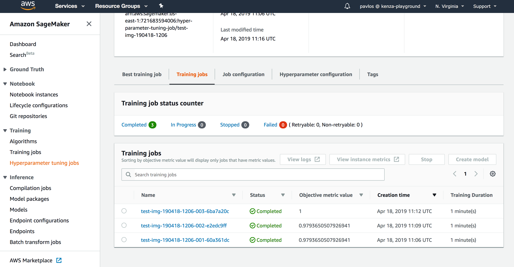
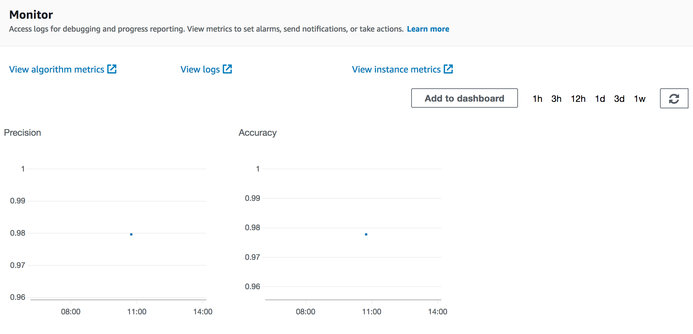

**Build Status**

master: [](https://travis-ci.org/Kenza-AI/sagify)

# sagify


A command-line utility to train and deploy Machine Learning/Deep Learning models on [AWS SageMaker](https://aws.amazon.com/sagemaker/) in a few simple steps!

For detailed reference to Sagify commands please go to: [Read the Docs](https://Kenza-AI.github.io/sagify/)

## Installation

### Prerequisites

sagify requires the following:

1. Python (2.7, 3.5, 3.6)
2. [Docker](https://www.docker.com/) installed and running
3. Configured [awscli](https://pypi.python.org/pypi/awscli)

### Install sagify

At the command line:

    pip install sagify


## Getting started

### Step 1: Clone Deep Learning Calculator repository

You're going to clone and train a Deep Learning codebase to evaluate arithmetic additions on up to 3 digit integers.

Clone repository:

    git clone https://github.com/Kenza-AI/deep-learning-addition.git

Optionally, if you want to use Python 2.7 replace the value of `REQUIRED_PYTHON` and `PYTHON_INTERPRETER` in `test_environment.py` and `Makefile`, respectively, to `python2`. 
    
Create environment:
    
    make create_environment

Don't forget to activate the virtualenv after the creation of environment by executing `workon deep-learning-addition`.

Install dependencies:

    make requirements
    
Generate training and validation data:

    make data

### Step 2: Initialize sagify

    sagify init

Type in `deep-learning-addition` for SageMaker app name and make sure to choose your preferred Python version, AWS profile and region. 

A module called `sagify` is created under the directory you provided. The structure is:
 
    sagify/
        local_test/
            test_dir/
                input/
                    config/
                        hyperparameters.json
                    data/
                        training/
                model/
                output/
            deploy_local.sh
            train_local.sh
        prediction/
            __init__.py
            nginx.conf
            predict.py
            predictor.py
            serve
            wsgi.py
        training/
            __init__.py
            train
        __init__.py
        build.sh
        Dockerfile
        executor.sh
        push.sh

### Step 3: Integrate sagify

As a Data Scientist, you only need to conduct a few actions. Sagify takes care of the rest:

1. Copy a subset of training data under `sagify/local_test/test_dir/input/data/training/` to test that training works locally
2. Implement `train(...)` function in `sagify/training/train`
3. Implement `predict(...)` function in `sagify/prediction/predict.py`
4. Optionally, specify hyperparameters in `sagify/local_test/test_dir/input/config/hyperparameters.json` 

Hence,

1. Copy `.npy` files from `data/processed/` to `sagify/local_test/test_dir/input/data/training/`

2. Replace the `TODOs` in the `try..except` of `train(...)` function in `sagify/training/train` file with:

        train_model.train(input_path=input_data_path, output_path=model_save_path)
    
    and after the `import traceback` at the top of the file, add:
     
        from src.models import train_model
        
     The body of `try..except` should look like:
     
        try:
            train_model.train(input_path=input_data_path, output_path=model_save_path)
            print('Training complete.')
        except Exception as e:

3. Replace the body of `predict(...)` function in `sagify/prediction/predict.py` with:

        def _format_addition(input_str):
            def _format(input_str_num, part_one):
                required_spaces_num = 3 - len(input_str_num)
                spaces = ''
                for _ in range(required_spaces_num):
                    spaces += ' '

                return spaces + input_str_num if part_one else input_str_num + spaces

            two_parts = input_str.split('+')
            formatted_part_one = _format(two_parts[0], True)
            formatted_part_two = _format(two_parts[1], False)

            return '{}+{}'.format(formatted_part_one, formatted_part_two)
            
        addition_str = _format_addition(json_input['addition'])
        
        from src.encoding_utils import decode_prediction, encode_query
        input_model = encode_query(addition_str)
        
        prediction = ModelService.predict(input_model)
        
        result = {
            'result': decode_prediction(prediction)
        }
        
        return result
        
    and replace the body of `get_model()` function in `ModelService` class in the same file with:
    
        if cls.model is None:
            import keras
            cls.model = keras.models.load_model(os.path.join(_MODEL_PATH, 'model.h5'))
        return cls.model
    

### Step 4: Build Docker image

It's time to build the Docker image that will contain the Deep Learning Addition codebase:

    sagify build -r requirements.txt
    
The path to `requirements.txt` is necessary to be specified so that all the required dependencies are installed in Docker image.

If you run `docker images | grep deep-learning-addition-img` in your terminal, you'll see the created Deep Learning Addition image.

### Step 5: Train Deep Learning model

Time to train the Deep Learning model in the newly built Docker image:

    sagify local train

This step takes ~5 minutes in a MacBook Pro Early 2015 3.1 GHz Intel Core i7.

### Step 6: Deploy Deep Learning model

Finally, serve the model as a REST Service:

    sagify local deploy

Run the following curl command on your terminal to verify that the REST Service works:

    curl -X POST \
    http://localhost:8080/invocations \
    -H 'Cache-Control: no-cache' \
    -H 'Content-Type: application/json' \
    -d '{
        "addition": "943+604"
     }'

It will be slow in the first couple of calls as it loads the model in a lazy manner.

Voila! That's a proof that this Deep Learning model is going to be trained and deployed on AWS SageMaker successfully. Now, go to the *Usage* section in [Sagify Docs](https://Kenza-AI.github.io/sagify/) to see how to train and deploy this Deep Learning model to AWS SageMaker!


## Hyperparameter Optimization

Given that you have configured your AWS Account as described in the previous section, you're now ready to perform Bayesian Hyperparameter Optimization on AWS SageMaker! The process is similar to training step.

### Step 1: Define Hyperparameter Configuration File

Define the Hyperparameter Configuration File. More specifically, you need to specify in a local JSON file the ranges for the hyperparameters, the name of the objective metric and its type (i.e. `Maximize` or `Minimize`). For example:

```
{
	"ParameterRanges": {
		"CategoricalParameterRanges": [
			{
				"Name": "kernel",
				"Values": ["linear", "rbf"]
			}
		],
		"ContinuousParameterRanges": [
		{
		  "MinValue": 0.001,
		  "MaxValue": 10,
		  "Name": "gamma"
		}
		],
		"IntegerParameterRanges": [
			{
				"Name": "C",
				"MinValue": 1,
				"MaxValue": 10
			}
		]
    },
    "ObjectiveMetric": {
    	"Name": "Precision",
        "Type": "Maximize"
    }
}
```

### Step 2: Implement Train function

Replace the `TODOs` in the `try..except` of `train(...)` function in `sagify/training/train` file with your logic. For example:

        from sklearn import datasets
        iris = datasets.load_iris()

        # Read the hyperparameter config json file
        import json
        with open(hyperparams_path) as _in_file:
            hyperparams_dict = json.load(_in_file)

        from sklearn import svm
        clf = svm.SVC(
            gamma=float(hyperparams_dict['gamma']),  # Values will be read as strings, so make sure to convert them to the right data type
            C=float(hyperparams_dict['C']),
            kernel=hyperparams_dict['kernel']
        )

        from sklearn.model_selection import train_test_split
        X_train, X_test, y_train, y_test = train_test_split(
            iris.data, iris.target, test_size=0.3, random_state=42)

        clf.fit(X_train, y_train)

        from sklearn.metrics import precision_score

        predictions = clf.predict(X_test)

        precision = precision_score(y_test, predictions, average='weighted')
        
        # Log the objective metric name with its calculated value. In tis example is Precision.
        # The objective name should be exactly the same with the one specified in the hyperparams congig json file.
        # The value must be a numeric (float or int).
        from sagify.api.hyperparameter_tuning import log_metric
        name = "Precision"
        log_metric(name, precision)

        from joblib import dump
        dump(clf, os.path.join(model_save_path, 'model.pkl'))

        print('Training complete.')
        
### Step 3: Build and Push Docker image

1. `sagify build -r requirements.txt` Make sure sagify is in your `requirements.txt` file.
2. `sagify push`

### Step 4: Call The CLI Command

And, finally, call the hyperparameter-optimization CLI command. For example:

     sagify cloud hyperparameter_optimization -i s3://my-bucket/training-data/ -o s3://my-bucket/output/ -e ml.m4.xlarge -h local/path/to/hyperparam_ranges.json 
    
### Step 5: Monitor Progress

You can monitor the progress via the SageMaker UI console. Here is an example of a finished Hyperparameter Optimization job:




## Commands

### Initialize

#### Name

Initializes a sagify module

#### Synopsis

    sagify init
    
#### Description

This command initializes a sagify module in the directory you provide when asked after you invoke the `init` command.

### Example

    sagify init


### Configure

#### Description

Updates an existing configuration value e.g. `python version` or `AWS region`.

#### Synopsis

    sagify configure [--aws-region AWS_REGION] [--aws-profile AWS_PROFILE] [--image-name IMAGE_NAME] [--python-version PYTHON_VERSION]

#### Optional Flags

`--aws-region AWS_REGION`: _AWS_ region where _Docker_ images are pushed and _SageMaker_ operations (_train_, _deploy_) are performed.

`--aws-profile AWS_PROFILE`: _AWS_ profile to use when interacting with _AWS_.

`--image-name IMAGE_NAME`: _Docker_ image name used when building for use with _SageMaker_. This shows up as an _AWS ECR_ repository on your _AWS_ account.

`--python-version PYTHON_VERSION`: _Python_ version used when building _SageMaker's_ _Docker_ images. Curently supported versions: `2.7` , `3.6`.


### Example

    sagify configure --aws-region us-east-2 --aws-profile default --image-name sage-docker-image-name --python-version 3.6


### Build

#### Name

Builds a Docker image

#### Synopsis

    sagify build --requirements-dir REQUIREMENTS_FILE
    
#### Description

This command builds a Docker image from code under the directory sagify is installed in. A `REQUIREMENTS_FILE` needs to be specified in order to install all required dependencies in the Docker image.
  
#### Required Flags

`--requirements-dir REQUIREMENTS_FILE` or `-r REQUIREMENTS_FILE`: Path to `REQUIREMENTS_FILE` 

#### Example

    sagify build -r requirements.txt


### Local Train

#### Name

Executes a Docker image in train mode

#### Synopsis

    sagify local train
    
#### Description

This command executes a Docker image in train mode. More specifically, it executes the `train(...)` function in `sagify/training/train` inside an already built Docker image (see Build command section).

#### Example

    sagify local train
    

### Local Deploy

#### Name

Executes a Docker image in serve mode

#### Synopsis

    sagify local deploy
    
#### Description

This command executes a Docker image in serve mode. More specifically, it runs a Flask REST app in Docker image and directs HTTP requests to `/invocations` endpoint. Then, the `/invocations` endpoint calls the `predict(...)` function in `sagify/prediction/predict.py` (see Build command section on how to build a Docker image).
 
#### Example

    sagify local deploy
    

### Push

#### Name

Pushes a Docker image to AWS Elastic Container Service

#### Synopsis

    sagify push [--aws-profile PROFILE_NAME] [--aws-region AWS_REGION] [--iam-role-arn IAM_ROLE] [--external-id EXTERNAL_ID]

#### Description

This command pushes an already built Docker image to AWS Elastic Container Service. Later on, AWS SageMaker will consume that image from AWS Elastic Container Service for train and serve mode.

> Only one of _iam-role-arn_ and _aws_profile_ can be provided. _external-id_ is ignored when no _iam-role-arn_ is provided.

#### Optional Flags

`--iam-role-arn IAM_ROLE` or `-i IAM_ROLE`: AWS IAM role to use for pushing to ECR

`--aws-region AWS_REGION` or `-r AWS_REGION`: The AWS region to push the image to

`--aws-profile PROFILE_NAME` or `-p PROFILE_NAME`: AWS profile to use for pushing to ECR

`--external-id EXTERNAL_ID` or `-e EXTERNAL_ID`: Optional external id used when using an IAM role

#### Example

    sagify push
    

### Cloud Upload Data

#### Name

Uploads data to AWS S3

#### Synopsis

    sagify cloud upload-data --input-dir LOCAL_INPUT_DATA_DIR --s3-dir S3_TARGET_DATA_LOCATION
    
#### Description
 
This command uploads content under `LOCAL_INPUT_DATA_DIR` to S3 under `S3_TARGET_DATA_LOCATION`

#### Required Flags

`--input-dir LOCAL_INPUT_DATA_DIR` or `-i LOCAL_INPUT_DATA_DIR`: Local input directory

`--s3-dir S3_TARGET_DATA_LOCATION` or `-s S3_TARGET_DATA_LOCATION`: S3 target location

#### Example

    sagify cloud upload-data -i ./training_data/ -s s3://my-bucket/training-data/


### Cloud Train

#### Name

Trains your ML/DL model using a Docker image on AWS SageMaker with input from S3

#### Synopsis

    sagify cloud train --input-s3-dir INPUT_DATA_S3_LOCATION --output-s3-dir S3_LOCATION_TO_SAVE_OUTPUT --ec2-type EC2_TYPE [--hyperparams-file HYPERPARAMS_JSON_FILE] [--volume-size EBS_SIZE_IN_GB] [--time-out TIME_OUT_IN_SECS] [--aws-tags TAGS] [--iam-role-arn IAM_ROLE] [--external-id EXTERNAL_ID] [--base-job-name BASE_JOB_NAME] [--job-name JOB_NAME] [--metric-names COMMA_SEPARATED_METRIC_NAMES]

#### Description

This command retrieves a Docker image from AWS Elastic Container Service and executes it on AWS SageMaker in train mode

#### Required Flags

`--input-s3-dir INPUT_DATA_S3_LOCATION` or `-i INPUT_DATA_S3_LOCATION`: S3 location to input data

`--output-s3-dir S3_LOCATION_TO_SAVE_OUTPUT` or `-o S3_LOCATION_TO_SAVE_OUTPUT`: S3 location to save output (models, reports, etc). Make sure that the output bucket already exists. Any not existing key prefix will be created by sagify.

`--ec2-type EC2_TYPE` or `-e EC2_TYPE`: ec2 type. Refer to <https://aws.amazon.com/sagemaker/pricing/instance-types/>

#### Optional Flags

`--hyperparams-file HYPERPARAMS_JSON_FILE` or `-h HYPERPARAMS_JSON_FILE`: Path to hyperparams JSON file
 
`--volume-size EBS_SIZE_IN_GB` or `-v EBS_SIZE_IN_GB`: Size in GB of the EBS volume (default: 30)

`--time-out TIME_OUT_IN_SECS` or `-s TIME_OUT_IN_SECS`: Time-out in seconds (default: 24 * 60 * 60)

`--aws-tags TAGS` or `-a TAGS`: Tags for labeling a training job of the form `tag1=value1;tag2=value2`. For more, see https://docs.aws.amazon.com/sagemaker/latest/dg/API_Tag.html.

`--iam-role-arn IAM_ROLE` or `-r IAM_ROLE`: AWS IAM role to use for training with *SageMaker*

`--external-id EXTERNAL_ID` or `-x EXTERNAL_ID`: Optional external id used when using an IAM role

`--base-job-name BASE_JOB_NAME` or `-n BASE_JOB_NAME`: Optional prefix for the SageMaker training job

`--job-name JOB_NAME`: Optional name for the SageMaker training job. NOTE: if a `--base-job-name` is passed along with this option, it will be ignored.

`--metric-names COMMA_SEPARATED_METRIC_NAMES`: Optional comma-separated metric names for tracking performance of training jobs. Example: `Precision,Recall,AUC`. Then, make sure you log these metric values using the `log_metric` function in the `train` function:

    ```
    ...
    from sagify.api.hyperparameter_tuning import log_metric
    log_metric("Precision:, precision)
    log_metric("Accuracy", accuracy)
    ...
    ```
    
   When the training jobs finishes, they will be stored in the CloudWatch algorithm metrics logs of the SageMaker training job:
   
   

#### Example

    sagify cloud train -i s3://my-bucket/training-data/ -o s3://my-bucket/output/ -e ml.m4.xlarge -h local/path/to/hyperparams.json -v 60 -t 86400 --metric-names Accuracy,Precision
    
    
### Cloud Hyperparameter Optimization

#### Name

Executes a Docker image in hyperparameter-optimization mode on AWS SageMaker

#### Synopsis

    sagify cloud hyperparameter_optimization --input-s3-dir INPUT_DATA_S3_LOCATION --output-s3-dir S3_LOCATION_TO_SAVE_MULTIPLE_TRAINED_MODELS --ec2-type EC2_TYPE [--hyperparams-config-file HYPERPARAM_RANGES_JSON_FILE] [--max-jobs MAX_NUMBER_OF_TRAINING_JOBS] [--max-parallel-jobs MAX_NUMBER_OF_PARALLEL_TRAINING_JOBS] [--volume-size EBS_SIZE_IN_GB] [--time-out TIME_OUT_IN_SECS] [--aws-tags TAGS] [--iam-role-arn IAM_ROLE] [--external-id EXTERNAL_ID] [--base-job-name BASE_JOB_NAME] [--job-name JOB_NAME] [--wait WAIT_UNTIL_HYPERPARAM_JOB_IS_FINISHED]

#### Description

This command retrieves a Docker image from AWS Elastic Container Service and executes it on AWS SageMaker in hyperparameter-optimization mode

#### Required Flags

`--input-s3-dir INPUT_DATA_S3_LOCATION` or `-i INPUT_DATA_S3_LOCATION`: S3 location to input data

`--output-s3-dir S3_LOCATION_TO_SAVE_OUTPUT` or `-o S3_LOCATION_TO_SAVE_OUTPUT`: S3 location to save output (models, reports, etc). Make sure that the output bucket already exists. Any not existing key prefix will be created by sagify.

`--ec2-type EC2_TYPE` or `-e EC2_TYPE`: ec2 type. Refer to <https://aws.amazon.com/sagemaker/pricing/instance-types/>

`--hyperparams-config-file HYPERPARAM_RANGES_JSON_FILE` or `-h HYPERPARAM_RANGES_JSON_FILE`: Local path to hyperparameters configuration file. Example:
```
{
	"ParameterRanges": {
		"CategoricalParameterRanges": [
			{
				"Name": "kernel",
				"Values": ["linear", "rbf"]
			}
		],
		"ContinuousParameterRanges": [
		{
		  "MinValue": 0.001,
		  "MaxValue": 10,
		  "Name": "gamma"
		}
		],
		"IntegerParameterRanges": [
			{
				"Name": "C",
				"MinValue": 1,
				"MaxValue": 10
			}
		]
    },
    "ObjectiveMetric": {
    	"Name": "Precision",
        "Type": "Maximize"
    }
}
```

#### Optional Flags

`--max-jobs MAX_NUMBER_OF_TRAINING_JOBS` or `-m MAX_NUMBER_OF_TRAINING_JOBS`: Maximum total number of training jobs to start for the hyperparameter tuning job (default: 3)

`--max-parallel-jobs MAX_NUMBER_OF_PARALLEL_TRAINING_JOBS` or `-p MAX_NUMBER_OF_PARALLEL_TRAINING_JOBS`: Maximum number of parallel training jobs to start (default: 1)
 
`--volume-size EBS_SIZE_IN_GB` or `-v EBS_SIZE_IN_GB`: Size in GB of the EBS volume (default: 30)

`--time-out TIME_OUT_IN_SECS` or `-s TIME_OUT_IN_SECS`: Time-out in seconds (default: 24 * 60 * 60)

`--aws-tags TAGS` or `-a TAGS`: Tags for labeling a training job of the form `tag1=value1;tag2=value2`. For more, see https://docs.aws.amazon.com/sagemaker/latest/dg/API_Tag.html.

`--iam-role-arn IAM_ROLE` or `-r IAM_ROLE`: AWS IAM role to use for training with *SageMaker*

`--external-id EXTERNAL_ID` or `-x EXTERNAL_ID`: Optional external id used when using an IAM role

`--base-job-name BASE_JOB_NAME` or `-n BASE_JOB_NAME`: Optional prefix for the SageMaker training job

`--job-name JOB_NAME`: Optional name for the SageMaker training job. NOTE: if a `--base-job-name` is passed along with this option, it will be ignored. 

`--wait WAIT_UNTIL_HYPERPARAM_JOB_IS_FINISHED` or `-w WAIT_UNTIL_HYPERPARAM_JOB_IS_FINISHED`: Optional flag to wait until Hyperparameter Tuning is finished. (default: don't wait) 

#### Example

    sagify cloud hyperparameter_optimization -i s3://my-bucket/training-data/ -o s3://my-bucket/output/ -e ml.m4.xlarge -h local/path/to/hyperparam_ranges.json -v 60 -t 86400


### Cloud Deploy

#### Name

Executes a Docker image in serve mode on AWS SageMaker

#### Synopsis

    sagify cloud deploy --s3-model-location S3_LOCATION_TO_MODEL_TAR_GZ --num-instance NUMBER_OF_EC2_INSTANCES --ec2-type EC2_TYPE [--aws-tags TAGS] [--iam-role-arn IAM_ROLE] [--external-id EXTERNAL_ID]

#### Description

This command retrieves a Docker image from AWS Elastic Container Service and executes it on AWS SageMaker in serve mode

#### Required Flags

`--s3-model-location S3_LOCATION_TO_MODEL_TAR_GZ` or `-m S3_LOCATION_TO_MODEL_TAR_GZ`: S3 location to to model tar.gz

`--num-instances NUMBER_OF_EC2_INSTANCES` or `n NUMBER_OF_EC2_INSTANCES`: Number of ec2 instances

`--ec2-type EC2_TYPE` or `e EC2_TYPE`: ec2 type. Refer to https://aws.amazon.com/sagemaker/pricing/instance-types/

#### Optional Flags

`--aws-tags TAGS` or `-a TAGS`: Tags for labeling a training job of the form `tag1=value1;tag2=value2`. For more, see https://docs.aws.amazon.com/sagemaker/latest/dg/API_Tag.html.

`--iam-role-arn IAM_ROLE` or `-r IAM_ROLE`: AWS IAM role to use for deploying with *SageMaker*

`--external-id EXTERNAL_ID` or `-x EXTERNAL_ID`: Optional external id used when using an IAM role

#### Example

    sagify cloud deploy -m s3://my-bucket/output/model.tar.gz -n 3 -e ml.m4.xlarge

    
### Cloud Batch Transform

#### Name

Executes a Docker image in batch transform mode on AWS SageMaker, i.e. runs batch predictions on user defined S3 data

#### Synopsis

    sagify cloud batch_transform --s3-model-location S3_LOCATION_TO_MODEL_TAR_GZ --s3-input-location S3_INPUT_LOCATION --s3-output-location S3_OUTPUT_LOCATION --num-instance NUMBER_OF_EC2_INSTANCES --ec2-type EC2_TYPE [--aws-tags TAGS] [--iam-role-arn IAM_ROLE] [--external-id EXTERNAL_ID]

#### Description

This command retrieves a Docker image from AWS Elastic Container Service and executes it on AWS SageMaker in batch transform mode, i.e. runs batch predictions on user defined S3 data. SageMaker will spin up REST container(s) and call it/them with input data(features) from a user defined S3 path.

Things to do:
- You should implement the predict function that expects a JSON containing the required feature values. It's the same predict function used for deploying the model as a REST service. Example of a JSON:
```
{
    "features": [5.1,3.5,1.4,0.2]
}
```
- The input S3 path should contain a file or multiple files where each line is a JSON, the same JSON format as the one expected in the predict function. Example of a file:
```
{"features": [5.1,3.5,1.4,0.2]}
{"features": [4.9,3.0,1.4,0.2]}
{"features": [4.7,3.2,1.3,0.2]}
{"features": [4.6,3.1,1.5,0.2]}
```

#### Required Flags

`--s3-model-location S3_LOCATION_TO_MODEL_TAR_GZ` or `-m S3_LOCATION_TO_MODEL_TAR_GZ`: S3 location to to model tar.gz

`--s3-input-location S3_INPUT_LOCATION` or `-i S3_INPUT_LOCATION`: s3 input data location

`--s3-output-location S3_OUTPUT_LOCATION` or `-o S3_OUTPUT_LOCATION`: s3 location to save predictions

`--num-instances NUMBER_OF_EC2_INSTANCES` or `n NUMBER_OF_EC2_INSTANCES`: Number of ec2 instances

`--ec2-type EC2_TYPE` or `e EC2_TYPE`: ec2 type. Refer to https://aws.amazon.com/sagemaker/pricing/instance-types/

#### Optional Flags

`--aws-tags TAGS` or `-a TAGS`: Tags for labeling a training job of the form `tag1=value1;tag2=value2`. For more, see https://docs.aws.amazon.com/sagemaker/latest/dg/API_Tag.html.

`--iam-role-arn IAM_ROLE` or `-r IAM_ROLE`: AWS IAM role to use for deploying with *SageMaker*

`--external-id EXTERNAL_ID` or `-x EXTERNAL_ID`: Optional external id used when using an IAM role

#### Example

    sagify cloud batch_transform -m s3://my-bucket/output/model.tar.gz -i s3://my-bucket/input_features -o s3://my-bucket/predictions -n 3 -e ml.m4.xlarge
