# sagify


Unlock the potential of Large Language Models (LLMs) and Machine Learning with Sagify on [AWS SageMaker](https://aws.amazon.com/sagemaker/), a robust command-line utility designed to simplify the training, fine-tuning and deployment process on AWS SageMaker. Serving as the cornerstone of an innovative LLM and Machine Learning platform, Sagify offers a streamlined workflow for building and deploying LLMs, empowering developers to create next-generation AI solutions with ease and efficiency.


## Why Sagify?

"Why should I use Sagify" you may ask.

We'll provide you with some examples of how Sagify can simplify and expedite your ML pipelines. You can train, tune and deploy a Machine Learning or just deploy an LLM on the same day by using Sagify!

### Empower your Use Cases with LLMs

You've likely found yourself in a scenario where you yearn to experiment with a variety of LLMs to ascertain their value for your specific use case. However, the daunting challenge lies in building the necessary tooling to interact with these LLMs effectively. Whether it's managed services like the OpenAI API or open-source LLMs, deploying them on your chosen cloud provider requires significant effort and resources.

Just use Sagify! Sagify serves as your go-to LLM platform, abstracting managed LLM services such as OpenAI and providing a robust infrastructure to deploy and serve open-source LLMs directly on your cloud account.

With Sagify, you can focus on what truly matters: exploring, experimenting, and harnessing the power of Language Models to propel your projects forward.

### No More Configuring Cloud Instances for Training a Machine Learning Model

Have you ever found yourself in a situation where your Machine Learning team is brimming with innovative ideas but lacks the tools to implement them efficiently? Here's a typical scenario:

1. All ML Scientists in the team have great ideas to solve problems using ML.
2. The team has built a feature engineering pipeline.
3. You probably have downloaded on your laptop a subset of the features data set and there's evidence that your model will work.
4. The moment of experimentation comes and you want to run 100s of training jobs on the cloud using the entire features data set.
5. Everybody in the team has some idea on how to do it but nobody wants to do it :-). 
6. ML Scientists should focus on ML and not on engineering tasks!
7. Just use Sagify! You just need to implement a train function!

### No More Infrastructure Pain to Run Hyperparameter Jobs on the Cloud

Yet another similar situation to the one before but this time even more challenging! It's exactly the same story line.

**Just use Sagify! Implement a train function and provide a path to json file that contains ranges for your hyperparameters!**
 
### No More Need to Hand Over Models to a Software Engineer to Deploy them

This is probably the most classic one! You need to run a batch prediction pipeline or deploy your model as a RESTful endpoint. Here's a real-world storyline:

1. The ML team somehow managed to train a fraud detection model and it's time to A/B test it against an existing heuristic.
2. The fraud detection backend team wants you to deploy the model behind a RESTful endpoint.
3. Nobody wants to do it in the ML team even if some people know how to do it.
4. Either way, tt's a waste of ML team's time to ask them to take care of the model deployment infrastructure.
5. The fraud detection backend team has other priorities and they have no time to help you in this task.
6. Just use Sagify! You just need to implement a predict function!

## Installation

### Prerequisites

sagify requires the following:

1. Python (3.7, 3.8, 3.9, 3.10, 3.11)
2. [Docker](https://www.docker.com/) installed and running
3. Configured [awscli](https://pypi.python.org/pypi/awscli)

### Install sagify

At the command line:

```sh
    pip install sagify
```

## Getting started -  LLM Deployment with no code
                
1. Make sure to configure your AWS account by following the instructions at section [Configure AWS Account](#configure-aws-account)
  
2. Finally, run the following command:

```sh
sagify cloud foundation-model-deploy --model-id model-txt2img-stabilityai-stable-diffusion-v2-1-base --model-version 1.* -n 1 -e ml.p3.2xlarge --aws-region us-east-1 --aws-profile sagemaker-dev
```
        
You can change the values for ec2 type (-e), aws region and aws profile with your preferred ones.

Once the Stable Diffusion model is deployed, you can use the generated code snippet to query it. Enjoy!

## Getting started -  No code deployment

1. Create a file with name `huggingface_config.json` with the following content:

```json
{
    "transformers_version": "4.6.1",
    "pytorch_version": "1.7.1",
    "hub": {
    "HF_MODEL_ID": "gpt2",
    "HF_TASK": "text-generation"
    }
}
```
                
2. Then, make sure to configure your AWS account by following the instructions at section [Configure AWS Account](#configure-aws-account)
  
3. Finally, run the following command:

```sh
sagify cloud lightning-deploy --framework huggingface -n 1 -e ml.c4.2xlarge --extra-config-file huggingface_config.json --aws-region us-east-1 --aws-profile sagemaker-dev
```
        
You can change the values for ec2 type (-e), aws region and aws profile with your preferred ones.

4. Once the Hugging Face model is deployed, you can go to https://console.aws.amazon.com/sagemaker/home?region=us-east-1#/endpoints (make sure you're on your preferred region) and find your deployed endpoint. For example:

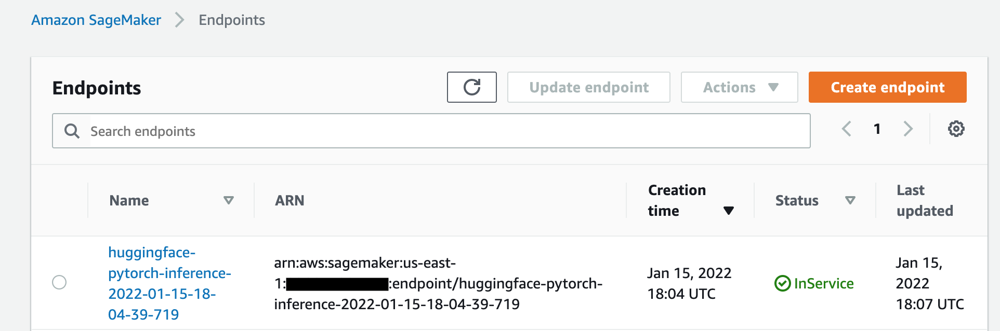

5. Then, you can click on your deployed endpoint and copy the endpoint url. For example:

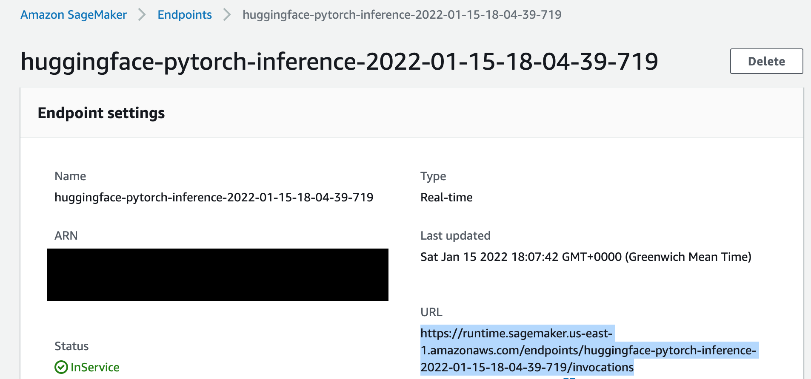

6. Postman is a good app to call the deployed endpoint. Here's an example on how to set up the AWS signature in order to call the endpoint:
 
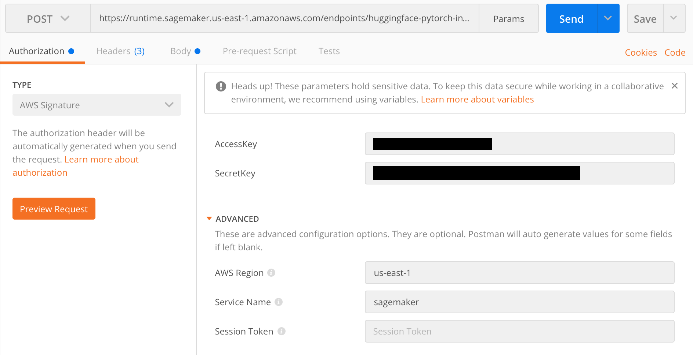

7. Finally, you can call the endpoint from Postman:

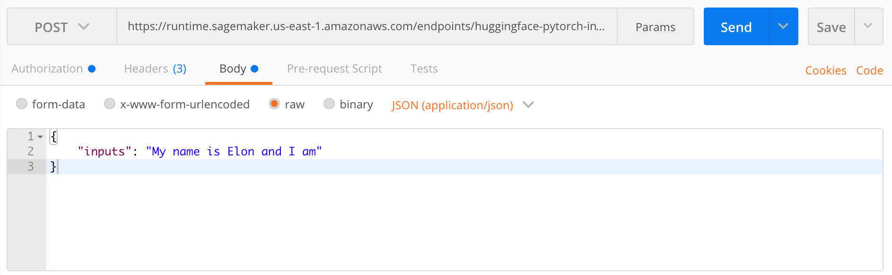

## Getting started - Custom Training and Deployment

### Step 1: Clone Machine Learning demo repository

You're going to clone and train a Machine Learning codebase to train a classifier for the Iris data set.

Clone repository:

```sh
git clone https://github.com/Kenza-AI/sagify-demo.git 
```

Cd into the cloned repo:

```sh
cd sagify-demo
```
    
Create environment:

```sh
mkvirtualenv sagify-demo
```

Don't forget to activate the virtualenv after the creation of environment by executing `workon sagify-demo`.

Install dependencies:

```sh
make requirements
```


### Step 2: Initialize sagify

```sh
sagify init
```

Type in `sagify-demo` for SageMaker app name, `N` in question `Are you starting a new project?`, `src` for question `Type in the directory where your code lives` and make sure to choose your preferred Python version, AWS profile and region. Finally, type `requirements.txt` in question `Type in the path to requirements.txt`.

A module called `sagify_base` is created under the `src` directory. The structure is:

```
sagify_base/
    local_test/
        test_dir/
            input/
                config/
                    hyperparameters.json
                data/
                    training/
            model/
            output/
        deploy_local.sh
        train_local.sh
    prediction/
        __init__.py
        nginx.conf
        predict.py
        prediction.py
        predictor.py
        serve
        wsgi.py
    training/
        __init__.py
        train
        training.py
    __init__.py
    build.sh
    Dockerfile
    executor.sh
    push.sh
```

### Step 3: Integrate sagify

As a Machine Learning engineer, you only need to conduct a few actions. Sagify takes care of the rest:

1. Copy a subset of training data under `sagify_base/local_test/test_dir/input/data/training/` to test that training works locally
2. Implement `train(...)` function in `sagify_base/training/training.py`
3. Implement `predict(...)` function in `sagify_base/prediction/prediction.py`
4. Optionally, specify hyperparameters in `sagify_base/local_test/test_dir/input/config/hyperparameters.json` 

Hence,

1. Copy `iris.data` files from `data` to `sagify_base/local_test/test_dir/input/data/training/`:

```bash
cp ./data/iris.data ./src/sagify_base/local_test/test_dir/input/data/training/
```

2. Replace the `TODOs` in the `train(...)` function in `sagify_base/training/training.py` file with:

```python
input_file_path = os.path.join(input_data_path, 'iris.data')
clf, accuracy = training_logic(input_file_path=input_file_path)

output_model_file_path = os.path.join(model_save_path, 'model.pkl')
joblib.dump(clf, output_model_file_path)

accuracy_report_file_path = os.path.join(model_save_path, 'report.txt')
with open(accuracy_report_file_path, 'w') as _out:
    _out.write(str(accuracy))
```
                
and at the top of the file, add:
     
```python
import os

import joblib

from iris_training import train as training_logic
```

3. Replace the body of `predict(...)` function in `sagify_base/prediction/prediction.py` with:

```python
model_input = json_input['features']
prediction = ModelService.predict(model_input)

return {
    "prediction": prediction.item()
}
```
        
and replace the body of `get_model()` function in `ModelService` class in the same file with:

```python
if cls.model is None:
    import joblib
    cls.model = joblib.load(os.path.join(_MODEL_PATH, 'model.pkl'))
return cls.model
```


### Step 4: Build Docker image

It's time to build the Docker image that will contain the Machine Learning codebase:

```sh
sagify build
```

If you run `docker images | grep sagify-demo` in your terminal, you'll see the created Sagify-Demo image.

### Step 5: Train model

Time to train the model for the Iris data set in the newly built Docker image:

```sh
sagify local train
```

Model file `model.pkl` and report file `report.txt` are now under `sagify_base/local_test/test_dir/model/`

### Step 6: Deploy model

Finally, serve the model as a REST Service:

```sh
sagify local deploy
```

Run the following curl command on your terminal to verify that the REST Service works:

```sh
curl -X POST \
http://localhost:8080/invocations \
-H 'Cache-Control: no-cache' \
-H 'Content-Type: application/json' \
-d '{
    "features":[[0.34, 0.45, 0.45, 0.3]]
}'
```

It will be slow in the first couple of calls as it loads the model in a lazy manner.

Voila! That's a proof that this Machine Learning model is going to be trained and deployed on AWS SageMaker successfully. Now, go to the *Usage* section in [Sagify Docs](https://Kenza-AI.github.io/sagify/) to see how to train and deploy this Machine Learning model to AWS SageMaker!


## AWS Account Setup

### Configure AWS Account

- Sign in to the AWS Management Console as an IAM user and open the IAM console at <https://console.aws.amazon.com/iam/>
- Select `Roles` from the list in the left-hand side, and click on *Create role*
- Then, select *SageMaker* as the image shows:


- Click *Next: Review* on the following page:

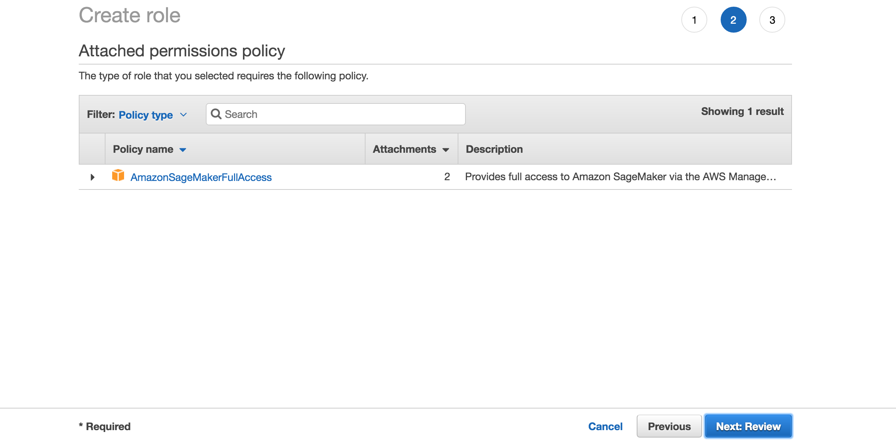

- Type a name for the SageMaker role, and click on *Create role*:


- Click on the created role:

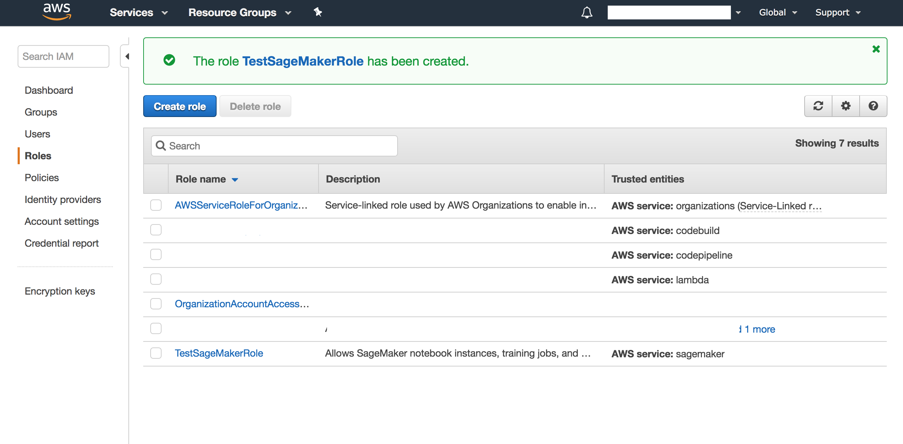

- Click on *Attach policy* and search for `AmazonEC2ContainerRegistryFullAccess`. Attach the corresponding policy:

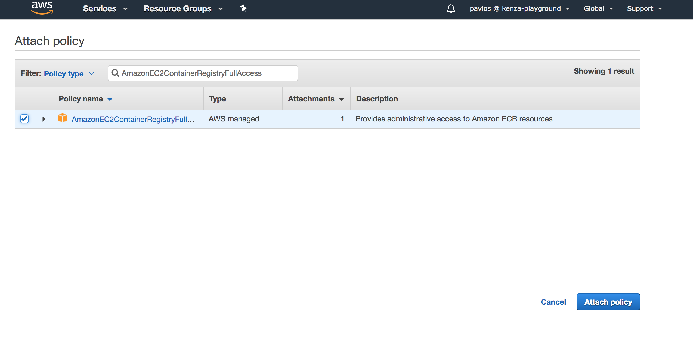

- Do the same to attach the `AmazonS3FullAccess`, `IAMReadOnlyAccess`, `AmazonSQSFullAccess `, `AWSLambdaFullAccess `, `AmazonEC2ContainerRegistryFullAccess` and `AmazonSageMakerFullAccess ` policies, and end up with the following:

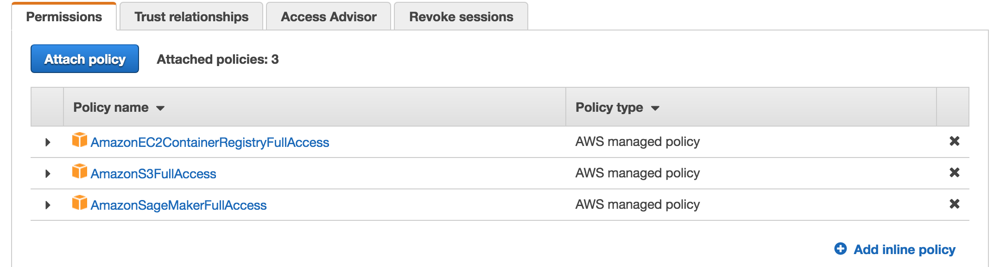

- Now, go to Users page by clicking on *Users* on the left-hand side.

- Click on your IAM user that you want to use for AWS SageMaker and attach the `AmazonSageMakerFullAccess` permission policy:

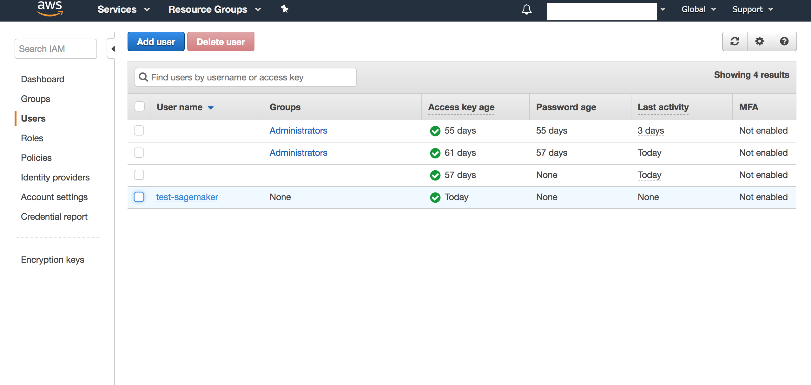

- Copy the ARN of that user:


- Then, go back the page of the Role you created and click on the *Trust relationships* tab:

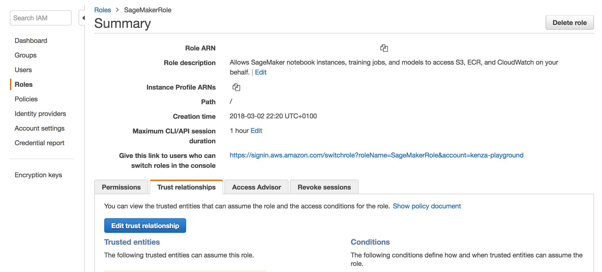

- Click on *Edit trust relationship* and add the following:

```json
{
    "Version": "2012-10-17",
    "Statement": [
        {
            "Sid": "",
            "Effect": "Allow",
            "Principal": {
                "AWS": "PASTE_THE_ARN_YOU_COPIED_EARLIER",
                "Service": "sagemaker.amazonaws.com"
            },
            "Action": "sts:AssumeRole"
        }
    ]
}
```
        
- You're almost there! Make sure that you have added the IAM user in your `~/.aws/credentials` file. For example:
    
```
[test-sagemaker]
aws_access_key_id = ...
aws_secret_access_key = ...
```

 - And, finally, add the following in the `~/.aws/config` file:
 
```
[profile test-sagemaker]
region = us-east-1 <-- USE YOUR PREFERRED REGION
role_arn = COPY_PASTE_THE_ARN_OF_THE_CREATED_ROLE_NOT_USER! for example: arn:aws:iam::...:role/TestSageMakerRole
source_profile = test-sagemaker
```

- That's it! From now on, choose the created AWS profile when initializing sagify.

- You can change the AWS profile/region in an already initialized sagify module by changing the value of `aws_profile`/`aws_region` in `.sagify.json`.

## LLM Usage

Sagify provides a set of intuitive command-line interface (CLI) commands to simplify the management of Language Model (LLM) infrastructure. Whether you're exploring available LLM models, starting or stopping LLM infrastructure, Sagify has you covered.

You can run `sagify llm platforms` to get a list of all supported LLM platforms:

- [OpenAI](https://platform.openai.com/docs/overview)
- [AWS Sagemaker](https://aws.amazon.com/sagemaker)

### OpenAI

The following models are offered for chat completions:

| Model Name | URL |
|:------------:|:-----:|
|gpt-4|https://platform.openai.com/docs/models/gpt-4-and-gpt-4-turbo|
|gpt-4-32k|https://platform.openai.com/docs/models/gpt-4-and-gpt-4-turbo|
|gpt-3.5-turbo|https://platform.openai.com/docs/models/gpt-4-and-gpt-4-turbo|

For image creation you can rely on the following models:

| Model Name | URL |
|:------------:|:-----:|
|dall-e-3|https://platform.openai.com/docs/models/dall-e|
|dall-e-2|https://platform.openai.com/docs/models/dall-e|

And for embeddings:

| Model Name | URL |
|:------------:|:-----:|
|text-embedding-3-large|https://platform.openai.com/docs/models/embeddings|
|text-embedding-3-small|https://platform.openai.com/docs/models/embeddings|
|text-embedding-ada-002|https://platform.openai.com/docs/models/embeddings|

### AWS Sagemaker

The following models are offered for chat completions:

| Model Name | URL |
|:------------:|:-----:|
|llama-2-7b|https://huggingface.co/meta-llama/Llama-2-7b|
|llama-2-13b|https://huggingface.co/meta-llama/Llama-2-13b|
|llama-2-70b|https://huggingface.co/meta-llama/Llama-2-70b|

For image creation you can rely on the following models:

| Model Name | URL |
|:------------:|:-----:|
|stabilityai-stable-diffusion-v2|https://huggingface.co/stabilityai/stable-diffusion-2|
|stabilityai-stable-diffusion-v2-1-base|https://huggingface.co/stabilityai/stable-diffusion-2-1-base|
|stabilityai-stable-diffusion-v2-fp16|https://huggingface.co/stabilityai/stable-diffusion-2/tree/fp16|

And for embeddings:

| Model Name | URL |
|:------------:|:-----:|
|bge-large-en|https://huggingface.co/BAAI/bge-large-en|
|bge-base-en|https://huggingface.co/BAAI/bge-base-en|
|gte-large|https://huggingface.co/thenlper/gte-large|
|gte-base|https://huggingface.co/thenlper/gte-base|
|e5-large-v2|https://huggingface.co/intfloat/e5-large-v2|
|bge-small-en|https://huggingface.co/BAAI/bge-small-en|
|e5-base-v2|https://huggingface.co/intfloat/e5-base-v2|
|multilingual-e5-large|https://huggingface.co/intfloat/multilingual-e5-large|
|e5-large|https://huggingface.co/intfloat/e5-large|
|gte-small|https://huggingface.co/thenlper/gte-small|
|e5-base|https://huggingface.co/intfloat/e5-base|
|e5-small-v2|https://huggingface.co/intfloat/e5-small-v2|
|multilingual-e5-base|https://huggingface.co/intfloat/multilingual-e5-base|
|all-MiniLM-L6-v2|https://huggingface.co/sentence-transformers/all-MiniLM-L6-v2|

All these lists of supported models on AWS Sagemaker can be retrieved by running the command `sagify llm models --all --provider sagemaker`. If you want to focus only on chat completions models, then run `sagify llm models --chat-completions --provider sagemaker`. For image creations and embeddings, `sagify llm models --image-creations --provider sagemaker` and `sagify llm models --embeddings --provider sagemaker`, respectively.

The architectural design of the LLM Platform on AWS SageMaker comprises a FastAPI Restful API serving as the client-facing interface (LLM Gateway). This API acts as the gateway through which end-users and other software systems interact to query the deployed Language Models (LLMs). Behind this FastAPI service, separate SageMaker endpoints are deployed to handle various tasks such as chat completions, image creations, and embeddings.

In a nutshell, the system allows you to configure which specific LLM models you want to deploy for each of these categories, along with specifying the EC2 instance to be utilized and the desired number of instances to be instantiated. This configuration can be easily managed through a dedicated configuration file, providing flexibility and customization options to tailor the platform according to your specific requirements.

TODO - Add architecture diagram

#### Deploy LLM Models

First step is to deploy the LLM model(s). You can choose to deploy all backend services (chat completions, image creations, embeddings) or some of them. 

If you want to deploy all of them, then run `sagify llm start --all`. This command will deploy all backend services (chat completions, image creations, embeddings) with the following configuration:

```json
{
    "chat_completions": {
        "model": "llama-2-7b",
        "instance_type": "ml.g5.2xlarge",
        "num_instances": 1,
    },
    "image_creations": {
        "model": "stabilityai-stable-diffusion-v2-1-base",
        "instance_type": "ml.p3.2xlarge",
        "num_instances": 1,
    },
    "embeddings": {
        "model": "gte-small",
        "instance_type": "ml.g5.2xlarge",
        "num_instances": 1,
    },
}
```

You can change this configuration by suppling your own config file, then you can run `sagify llm start -all --config YOUR_CONFIG_FILE.json`.

It takes 15 to 30 minutes to deploy all the backend services as Sagemaker endpoints.

The deployed model names, which are the Sagemaker endpoint names, are printed out and stored in the hidden file `.sagify_llm_infra.json`. You can also access them from the AWS Sagemaker web console.

#### Deploy FastAPI LLM Gateway - Local

Once the LLM endpoints are deployed, you can deploy the FastAPI LLM Gateway locally. 

In case of using the AWS Sagemaker platform, you need to define the following env variables before you start the LLM Gateway server:

- `AWS_ACCESS_KEY_ID`: It can be the same one you use locally for Sagify. It should have access to Sagemaker and S3. Example: `export AWS_ACCESS_KEY_ID=...`.
- `AWS_SECRET_ACCESS_KEY`:  It can be the same one you use locally for Sagify. It should have access to Sagemaker and S3. Example: `export AWS_ACCESS_KEY_ID=...`.
- `AWS_REGION_NAME`: AWS region where the LLM backend services (Sagemaker endpoints) are deployed.
- `S3_BUCKET_NAME`: S3 bucket name where the created images by the image creation backend service are stored.
- `IMAGE_URL_TTL_IN_SECONDS`: TTL in seconds of the temporary url to the created images. Default value: 3600.
- `SM_CHAT_COMPLETIONS_MODEL`: The Sagemaker endpoint name where the chat completions model is deployed.
- `SM_EMBEDDINGS_MODEL`: The Sagemaker endpoint name where the embeddings model is deployed.
- `SM_IMAGE_CREATION_MODEL`: The Sagemaker endpoint name where the image creation model is deployed.

In case of using the OpenAI platform, you need to define the following env variables before you start the LLM Gateway server:

- `OPENAI_API_KEY`: Your OpenAI API key. Example: `export OPENAI_API_KEY=...`.
- `OPENAI_CHAT_COMPLETIONS_MODEL`: It should have one of values [here](https://platform.openai.com/docs/models/gpt-3-5-turbo) or [here](https://platform.openai.com/docs/models/gpt-4-and-gpt-4-turbo).
- `OPENAI_EMBEDDINGS_MODEL`: It should have one of values [here](https://platform.openai.com/docs/models/embeddings).
- `OPENAI_IMAGE_CREATION_MODEL`: It should have one of values [here](https://platform.openai.com/docs/models/dall-e).

Now, you can run the command `sagify llm start-local-gateway` to start the LLM Gateway locally.

#### Deploy FastAPI LLM Gateway - Local - Docker

TODO -> Improve

- Build the Docker image `docker build -t sagify-llm-gateway .`
- Run the Docker image for OpenAI `docker run -p 8000:8000 -e OPENAI_API_KEY=sk-... -e OPEN_AI_CHAT_COMPLETIONS_MODEL=gpt-3.5-turbo -e OPEN_AI_EMBEDDINGS_MODEL=text-embedding-3-small -e OPEN_AI_IMAGE_CREATION_MODEL=dall-e-3 --name my-fastapi-container-13 sagify-llm-gateway`
- Run the Docker image for AWS Sagemaker `docker run -p 8000:8000 -e AWS_ACCESS_KEY_ID=... -e AWS_SECRET_ACCESS_KEY=... -e AWS_REGION_NAME=... -e S3_BUCKET_NAME=... -e IMAGE_URL_TTL_IN_SECONDS=... -e SM_CHAT_COMPLETIONS_MODEL=... -e SM_EMBEDDINGS_MODEL=... -e SM_IMAGE_CREATION_MODEL=...`

If you want to support both platforms (OpenAI and AWS Sagemaker), then pass all the env variables for both platforms.

#### Deploy FastAPI LLM Gateway - AWS Fargate

In case you want to deploy the LLM Gateway to AWS Fargate, then you can follow these general steps:

1. Containerize the FastAPI LLM Gateway: TODO
2. Push Docker image to Amazon ECR
3. Define Task Definition: Define a task definition that describes how to run your containerized FastAPI application on Fargate. Specify the Docker image, container port, CPU and memory requirements, and environment variables.
4. Create ECS Service: Create a Fargate service using the task definition. Configure the desired number of tasks, networking options, load balancing, and auto-scaling settings.
4. Set Environment Variables: Ensure that your FastAPI application retrieves the environment variables correctly at runtime.

Here's an example CloudFormation template to deploy a FastAPI service to AWS Fargate with 5 environment variables:

```yaml
Resources:
  MyFargateTaskDefinition:
    Type: AWS::ECS::TaskDefinition
    Properties:
      Family: my-fargate-task
      ContainerDefinitions:
        - Name: fastapi-container
          Image: <YOUR_ECR_REPOSITORY_URI>
          Memory: 512
          PortMappings:
            - ContainerPort: 80
          Environment:
            - Name: AWS_ACCESS_KEY_ID
              Value: "value1"
            - Name: AWS_SECRET_ACCESS_KEY
              Value: "value2"
            - Name: AWS_REGION_NAME
              Value: "value3"
            - Name: S3_BUCKET_NAME
              Value: "value4"
            - Name: IMAGE_URL_TTL_IN_SECONDS
              Value: "value5"
            - Name: SM_CHAT_COMPLETIONS_MODEL
              Value: "value6"
            - Name: SM_EMBEDDINGS_MODEL
              Value: "value7"
            - Name: SM_IMAGE_CREATION_MODEL
              Value: "value8"

  MyFargateService:
    Type: AWS::ECS::Service
    Properties:
      Cluster: default
      TaskDefinition: !Ref MyFargateTaskDefinition
      DesiredCount: 2
      LaunchType: FARGATE
      NetworkConfiguration:
        AwsvpcConfiguration:
          Subnets:
            - <YOUR_SUBNET_ID>
          SecurityGroups:
            - <YOUR_SECURITY_GROUP_ID>
```

## Classic Machine Learning Usage

### Push Docker Image to AWS ECR

If you have followed all the steps of *Getting Started*, run `sagify push` to push the Docker image to AWS ECR. This step may take some time depending on your internet connection upload speed.

### Create S3 Bucket

Make sure to create an S3 bucket with a name of your choice, for example: `sagify-demo`

### Upload Training Data

Execute `sagify cloud upload-data -i data/ -s s3://sagify-demo/training-data` to upload training data to S3

### Train on AWS SageMaker

Execute `sagify cloud train -i s3://sagify-demo/training-data/ -o s3://sagify-demo/output/ -e ml.m4.xlarge` to train the Machine Learning model on SageMaker. This command will use the pushed Docker image.

Copy the displayed Model S3 location after the command is executed (example: `s3://sagify-demo/output/sagify-demo-2018-04-29-15-04-14-483/output/model.tar.gz`)

### Deploy on AWS SageMaker

Execute `sagify cloud deploy -m s3://sagify-demo/output/.../output/model.tar.gz -n 3 -e ml.m4.xlarge` to deploy the model on SageMaker.

### Call SageMaker REST Endpoint

Find the endpoint URL under *Endpoints* in AWS SageMaker service on AWS console. Please, refer to <https://docs.aws.amazon.com/apigateway/latest/developerguide/how-to-use-postman-to-call-api.html> on how to call it from Postman as authorization is required.
 
Remember that it's a POST HTTP request with Content-Type `application/json`, and the request JSON body is of the form:

```json
{
    "features":[[0.34, 0.45, 0.45, 0.3]]
}
```

## Hyperparameter Optimization

Given that you have configured your AWS Account as described in the previous section, you're now ready to perform Bayesian Hyperparameter Optimization on AWS SageMaker! The process is similar to training step.

### Step 1: Define Hyperparameter Configuration File

Define the Hyperparameter Configuration File. More specifically, you need to specify in a local JSON file the ranges for the hyperparameters, the name of the objective metric and its type (i.e. `Maximize` or `Minimize`). For example:

```json
{
	"ParameterRanges": {
		"CategoricalParameterRanges": [
			{
				"Name": "kernel",
				"Values": ["linear", "rbf"]
			}
		],
		"ContinuousParameterRanges": [
		{
		  "MinValue": 0.001,
		  "MaxValue": 10,
		  "Name": "gamma"
		}
		],
		"IntegerParameterRanges": [
			{
				"Name": "C",
				"MinValue": 1,
				"MaxValue": 10
			}
		]
    },
    "ObjectiveMetric": {
    	"Name": "Precision",
        "Type": "Maximize"
    }
}
```

### Step 2: Implement Train function

Replace the `TODOs` in the `train(...)` function in `sagify_base/training/training.py` file with your logic. For example:

```python
from sklearn import datasets
iris = datasets.load_iris()

# Read the hyperparameter config json file
import json
with open(hyperparams_path) as _in_file:
    hyperparams_dict = json.load(_in_file)

from sklearn import svm
clf = svm.SVC(
    gamma=float(hyperparams_dict['gamma']),  # Values will be read as strings, so make sure to convert them to the right data type
    C=float(hyperparams_dict['C']),
    kernel=hyperparams_dict['kernel']
)

from sklearn.model_selection import train_test_split
X_train, X_test, y_train, y_test = train_test_split(
    iris.data, iris.target, test_size=0.3, random_state=42)

clf.fit(X_train, y_train)

from sklearn.metrics import precision_score

predictions = clf.predict(X_test)

precision = precision_score(y_test, predictions, average='weighted')

# Log the objective metric name with its calculated value. In tis example is Precision.
# The objective name should be exactly the same with the one specified in the hyperparams congig json file.
# The value must be a numeric (float or int).
from sagify.api.hyperparameter_tuning import log_metric
name = "Precision"
log_metric(name, precision)

from joblib import dump
dump(clf, os.path.join(model_save_path, 'model.pkl'))

print('Training complete.')
```
        
### Step 3: Build and Push Docker image

1. `sagify build` Make sure sagify is in your `requirements.txt` file.
2. `sagify push`

### Step 4: Call The CLI Command

And, finally, call the hyperparameter-optimization CLI command. For example:

```sh
sagify cloud hyperparameter-optimization -i s3://my-bucket/training-data/ -o s3://my-bucket/output/ -e ml.m4.xlarge -h local/path/to/hyperparam_ranges.json 
```
    
### Step 5: Monitor Progress

You can monitor the progress via the SageMaker UI console. Here is an example of a finished Hyperparameter Optimization job:


## Monitor ML Models in Production

## Superwise

Superwise provides organizations with the ability to streamline model observability and the monitoring process 🚀. The solution is platform-agnostic and provides an extensive freemium tier.


The steps below explain how you can integrate with Superwise to gain full visibility into your deployed models. Once you complete the integration, you can use the Superwise platform to define workflows that automatically monitor: data drift, performance degradation, data integrity, model activity, or any other customized monitoring use case.

### Step 1: Create a Superwise Account

Go to [Superwise](https://portal.superwise.ai) and click the signup button to create an account. Using the free tier, you can monitor up to three models.

### Step 2: Add your model 


You can use the Superwise SDK to create the model. To use the SDK you should [generate tokens](https://docs.superwise.ai/docs/authentication).


### Step 3: Initialize sagify

To initialize sagify, type the following command
`sagify init`


Enter `iris-model` for the SageMaker app name, and answer `y` to the prompt asking  `Are you starting a new project?` 

Next, make sure to choose Python version 3 and the AWS profile and region you wish to use. Type `requirements.txt` in answer to the prompt `Type in the path to requirements.txt.`

A module called sagify_base is created under the src directory. The module’s structure is as follows:

```
sagify_base/
    local_test/
        test_dir/
            input/
                config/
                    hyperparameters.json
                data/
                    training/
            model/
            output/
        deploy_local.sh
        train_local.sh
    prediction/
        __init__.py
        nginx.conf
        predict.py
        prediction.py
        predictor.py
        serve
        wsgi.py
    training/
        __init__.py
        train
        training.py
    __init__.py
    build.sh
    Dockerfile
    executor.sh
    push.sh
```

### Step 4: Initialize the requirements.txt


Make sure the 'requirements.txt' at the root of the project has the following content:

```
awscli
flake8
Flask
joblib
pandas
s3transfer
sagify>=0.18.0
scikit-learn
superwise
```

### Step 5: Download the Iris data set

Download the Iris data set from <https://archive.ics.uci.edu/ml/machine-learning-databases/iris/iris.data> and save it in a file named "iris.data" under `src/sagify_base/local_test/test_dir/input/data/training/`.

### Step 6: Implement the training logic

In the `src/sagify_base/training/training.py` file, replace the `TODOs` in the `train(...)` function with the following text:

```python
input_file_path = os.path.join(input_data_path, 'iris.data')

df = pd.read_csv(
    input_file_path,
    header=None,
    names=['feature1', 'feature2', 'feature3', 'feature4', 'label']
)
df['date_time'] = pd.to_datetime('now')
df["id"] = df.apply(lambda _: uuid.uuid4(), axis=1)
df_train, df_test = train_test_split(df, test_size=0.3, random_state=42)

features_train_df = df_train[['feature1', 'feature2', 'feature3', 'feature4']]
labels_train_df = df_train[['label']]

features_train = features_train_df.values
labels_train = labels_train_df.values.ravel()

features_test_df = df_test[['feature1', 'feature2', 'feature3', 'feature4']]
labels_test_df = df_test[['label']]

features_test = features_test_df.values
labels_test = labels_test_df.values.ravel()

clf = SVC(gamma='auto', kernel="linear")
clf.fit(features_train, labels_train)

###### Report Testing Data ######
test_predictions = clf.predict(features_test)

accuracy = accuracy_score(labels_test, test_predictions)
output_model_file_path = os.path.join(model_save_path, 'model.pkl')
joblib.dump(clf, output_model_file_path)

accuracy_report_file_path = os.path.join(model_save_path, 'report.txt')
with open(accuracy_report_file_path, 'w') as _out:
    _out.write(str(accuracy))

## create superwise model
model = sw.model.create(Model(name=MODEL_NAME,
                                description="Iris Model Demo")
                        )
df["prediction"] = clf.predict(df[['feature1', 'feature2', 'feature3', 'feature4']])
## summarize the data, use infer_dtype for auto detect features
entities = sw.data_entity.summarise(
    data=df,
    entities_dtypes=infer_dtype(df),
    specific_roles={
        "date_time" : DataEntityRole.TIMESTAMP,
        "id" : DataEntityRole.ID,
        "label" : DataEntityRole.LABEL,
        "prediction" : DataEntityRole.PREDICTION_VALUE
    },
    importance=dict(zip(clf.coef_[0], ['feature1', 'feature2', 'feature3', 'feature4']))
)

## create and activate superwise version
version = Version(model_id=model.id, name="V1", data_entities=entities)
active_version = sw.version.create(version)
sw.version.activate(active_version.id)
```

And, at the top of the file, add the following:
    
```python
import uuid

import joblib
import os

import pandas as pd
from sklearn.metrics import accuracy_score
from sklearn.model_selection import train_test_split
from sklearn.svm import SVC
from superwise import Superwise
from superwise.models.model import Model
from superwise.models.version import Version
from superwise.resources.superwise_enums import DataEntityRole
from superwise.controller.infer import infer_dtype
MODEL_NAME = "Iris Model"

sw = Superwise(
    client_id="<my client_id>",
    secret="<my secret>",
)
```

### Step 7: Implement the prediction logic

In the file `src/sagify_base/prediction/prediction.py` replace the body of the `predict(...)` function with the following:

```python
model_input = json_input['features']
prediction = ModelService.predict(model_input)
model = ModelService.get_superwise_model(MODEL_NAME)

for m in model_input:
    records = {
        "date_time" : str(datetime.utcnow()),
        "id" : str(uuid.uuid4()),
        "prediction": prediction,
        "feature1": m[0],
        "feature2": m[1],
        "feature3": m[2],
        "feature4": m[3]
    }
    transaction_id = sw.transaction.log_records(
        model_id=model[0].id,
        version_id=model[0].active_version_id,
        records=records
    )
    print(f"Created transaction:  {transaction_id}")
return {
    "prediction": prediction.item()
}
```

Within the `ModelService` class in the same file, replace the body of the `get_model()` function with the following:

```python
if cls.model is None:
    cls.model = joblib.load(os.path.join(_MODEL_PATH, 'model.pkl'))
return cls.model
```

Then, add a new function called `get_superwise_model()` to the ‘ModelService’ class, using the following:

```python
@classmethod
def get_superwise_model(cls,model_name):
    """ Get superwise model using superwise SDK """
    return sw.model.get_by_name(model_name)
```

Now, add the following text to the top of the file:

```python
from superwise import Superwise
import joblib
import os
import pandas as pd
from datetime import datetime
import uuid

sw = Superwise(
    client_id="<my client_id>",
    secret="<my secret>",
)
MODEL_NAME = "Iris Model"
_MODEL_PATH = os.path.join('/opt/ml/', 'model')  # Path where all your model(s) live in
```

### Step 8: Build and train the ML model

If you’re ready to build and train the ML model, run the command `sagify build` and then run `sagify local train`

### Step 9: Call the inference REST API

To use the REST API, run the command `sagify local deploy` 

Once that’s done, call the inference endpoint by running the following curl command:

```python
curl -X POST \
http://localhost:8080/invocations \
-H 'Cache-Control: no-cache' \
-H 'Content-Type: application/json' \
 -d '{
	 "features":[[0.34, 0.45, 0.45, 0.3]]
}'
```

You should now be able to see data coming in on the Superwise dashboards.

## Aporia

In this part, you'll integrate with [Aporia](https://www.aporia.com/) in order to monitor deployed ML models. More specifically, you'll monitor:

1. data drifting
2. model degradation
3. data integrity

### Step 1: Create Aporia Account

Go to [Aporia](https://www.aporia.com/) and create an account. There's a generous free tier.

### Step 2: Create model at Aporia
 
Add your model to Aporia's console. Click the **Add Model** button in the Models page and name it "Iris Model"

### Step 3: Initialize sagify
```sh
sagify init
```

Type in `iris-model` for SageMaker app name, `y` in question `Are you starting a new project?`, make sure to choose Python version 3 and your preferred AWS profile and region. Finally, type `requirements.txt` in question `Type in the path to requirements.txt`.

A module called `sagify_base` is created under the `src` directory. The structure is:
 
```
sagify_base/
    local_test/
        test_dir/
            input/
                config/
                    hyperparameters.json
                data/
                    training/
            model/
            output/
        deploy_local.sh
        train_local.sh
    prediction/
        __init__.py
        nginx.conf
        predict.py
        prediction.py
        predictor.py
        serve
        wsgi.py
    training/
        __init__.py
        train
        training.py
    __init__.py
    build.sh
    Dockerfile
    executor.sh
    push.sh
```
        
### Step 4: Initialize the requirements.txt

The `requirements.txt` at the root of the project must have the following content:

```
awscli
flake8
Flask
joblib
pandas
s3transfer
sagify>=0.18.0
scikit-learn
aporia[all]
```
        
### Step 5: Download Iris data set

Download the Iris data set from <https://archive.ics.uci.edu/ml/machine-learning-databases/iris/iris.data> and save it in a file named "iris.data" under `src/sagify_base/local_test/test_dir/input/data/training/`.

### Step 6: Implement Training logic

Replace the `TODOs` in the `train(...)` function in `src/sagify_base/training/training.py` file with the following. **Remember** to use the `model_id` that Aporia gave you in step 2:

```python
input_file_path = os.path.join(input_data_path, 'iris.data')

df = pd.read_csv(
    input_file_path,
    header=None,
    names=['feature1', 'feature2', 'feature3', 'feature4', 'label']
)

df_train, df_test = train_test_split(df, test_size=0.3, random_state=42)

features_train_df = df_train[['feature1', 'feature2', 'feature3', 'feature4']]
labels_train_df = df_train[['label']]

features_train = features_train_df.values
labels_train = labels_train_df.values.ravel()

features_test_df = df_test[['feature1', 'feature2', 'feature3', 'feature4']]
labels_test_df = df_test[['label']]

features_test = features_test_df.values
labels_test = labels_test_df.values.ravel()

###### Report Version Schema ######
apr_model_version = 'v1'
apr_model_type = 'multiclass'  # Select model type: "binary" or "regression"

###### Create a model version ######
apr_model = aporia.create_model_version(
    model_id="REPLACE WITH YOUR APORIA MODEL ID",
    model_version=apr_model_version,
    model_type=apr_model_type,
    features=aporia.pandas.infer_schema_from_dataframe(features_train_df),
    predictions=aporia.pandas.infer_schema_from_dataframe(labels_train_df)
)

###### Report Training Data ######
apr_model.log_training_set(
    features=features_train_df,
    labels=labels_train_df
)

clf = SVC(gamma='auto')
clf.fit(features_train, labels_train)

###### Report Testing Data ######
test_predictions = clf.predict(features_test)
apr_model.log_test_set(
    features=features_test_df,
    labels=labels_test_df,
    predictions=pd.DataFrame({'label': test_predictions})
)

accuracy = accuracy_score(labels_test, test_predictions)

output_model_file_path = os.path.join(model_save_path, 'model.pkl')
joblib.dump(clf, output_model_file_path)

accuracy_report_file_path = os.path.join(model_save_path, 'report.txt')
with open(accuracy_report_file_path, 'w') as _out:
    _out.write(str(accuracy))
```
                
and at the top of the file, add:
     
```python
import joblib
import os

import aporia
import pandas as pd
from sklearn.metrics import accuracy_score
from sklearn.model_selection import train_test_split
from sklearn.svm import SVC


###### Initiate Aporia ######
aporia.init(token="TOKEN PROVIDED BY APORIA", environment="YOUR CHOSEN ENV VALUE")
```
                    
### Step 7: Implement Prediction logic

Replace the body of `predict(...)` function in `src/sagify_base/prediction/prediction.py` with. **Remember** to use the `model_id` that Aporia gave you in step 2:

```python
model_input = json_input['features']
prediction = ModelService.predict(model_input)

###### Report Inference ######
apr_prediction_id = str(uuid.uuid4())

apr_model = aporia.Model("REPLACE WITH YOUR APORIA MODEL ID", "v1")
apr_model.log_prediction(
    id=apr_prediction_id,
    features={
        'feature1': model_input[0][0],
        'feature2': model_input[0][1],
        'feature3': model_input[0][2],
        'feature4': model_input[0][3],
    },
    predictions={
        'label': prediction.item()
    },
)

apr_model.flush()

return {
    "prediction": prediction.item()
}
```
        
replace the body of `get_model()` function in `ModelService` class in the same file with:
    
```python
if cls.model is None:
    from sklearn.externals import joblib
    cls.model = joblib.load(os.path.join(_MODEL_PATH, 'model.pkl'))
return cls.model
```
        
and the top of the file must look like:

```python
import aporia
import os
import uuid


###### Initiate Aporia ######
aporia.init(token="TOKEN PROVIDED BY APORIA", environment="YOUR CHOSEN ENV VALUE")

_MODEL_PATH = os.path.join('/opt/ml/', 'model')  # Path where all your model(s) live in
```
        
### Step 8: Build and Train the ML model

Run `sagify build` and after that `sagify local train`


### Step 9: Call inference REST API

Run `sagify local deploy` and then run the following curl command to call the inference endpoint:

```sh
curl -X POST \
http://localhost:8080/invocations \
-H 'Cache-Control: no-cache' \
-H 'Content-Type: application/json' \
-d '{
    "features":[[0.34, 0.45, 0.45, 0.3]]
}'
```
    
Now you should be able to see data coming in on Aporia dashboards.


## Commands

### Initialize

#### Name

Initializes a sagify module

#### Synopsis

```sh
sagify init
```
    
#### Description

This command initializes a sagify module in the directory you provide when asked after you invoke the `init` command.

### Example

```sh
sagify init
```


### Configure

#### Description

Updates an existing configuration value e.g. `python version` or `AWS region`.

#### Synopsis

```sh
sagify configure [--aws-region AWS_REGION] [--aws-profile AWS_PROFILE] [--image-name IMAGE_NAME] [--python-version PYTHON_VERSION]
```

#### Optional Flags

`--aws-region AWS_REGION`: _AWS_ region where _Docker_ images are pushed and _SageMaker_ operations (_train_, _deploy_) are performed.

`--aws-profile AWS_PROFILE`: _AWS_ profile to use when interacting with _AWS_.

`--image-name IMAGE_NAME`: _Docker_ image name used when building for use with _SageMaker_. This shows up as an _AWS ECR_ repository on your _AWS_ account.

`--python-version PYTHON_VERSION`: _Python_ version used when building _SageMaker's_ _Docker_ images. Currently supported versions: `3.6`.

### Example

```sh
sagify configure --aws-region us-east-2 --aws-profile default --image-name sage-docker-image-name --python-version 3.6
```


### Build

#### Name

Builds a Docker image

#### Synopsis
```sh
sagify build
```
    
#### Description

This command builds a Docker image from code under the directory sagify is installed in. A `REQUIREMENTS_FILE` needs to be specified during `sagify init` or later via `sagify configure --requirements-dir` for all required dependencies to be installed in the Docker image. 

#### Example
```sh
sagify build
```


### Local Train

#### Name

Executes a Docker image in train mode

#### Synopsis
```sh
sagify local train
```
    
#### Description

This command executes a Docker image in train mode. More specifically, it executes the `train(...)` function in `sagify_base/training/training.py` inside an already built Docker image (see Build command section).

#### Example
```sh
sagify local train
```
 

### Local Deploy

#### Name

Executes a Docker image in serve mode

#### Synopsis
```sh
sagify local deploy
```
    
#### Description

This command executes a Docker image in serve mode. More specifically, it runs a Flask REST app in Docker image and directs HTTP requests to `/invocations` endpoint. Then, the `/invocations` endpoint calls the `predict(...)` function in `sagify_base/prediction/prediction.py` (see Build command section on how to build a Docker image).
 
#### Example
```sh
sagify local deploy
```
 

### Push

#### Name

Pushes a Docker image to AWS Elastic Container Service

#### Synopsis
```sh
sagify push [--aws-profile PROFILE_NAME] [--aws-region AWS_REGION] [--iam-role-arn IAM_ROLE] [--external-id EXTERNAL_ID]
```

#### Description

This command pushes an already built Docker image to AWS Elastic Container Service. Later on, AWS SageMaker will consume that image from AWS Elastic Container Service for train and serve mode.

> Only one of _iam-role-arn_ and _aws_profile_ can be provided. _external-id_ is ignored when no _iam-role-arn_ is provided.

#### Optional Flags

`--iam-role-arn IAM_ROLE` or `-i IAM_ROLE`: AWS IAM role to use for pushing to ECR

`--aws-region AWS_REGION` or `-r AWS_REGION`: The AWS region to push the image to

`--aws-profile PROFILE_NAME` or `-p PROFILE_NAME`: AWS profile to use for pushing to ECR

`--external-id EXTERNAL_ID` or `-e EXTERNAL_ID`: Optional external id used when using an IAM role

#### Example
```sh
sagify push
```
 

### Cloud Upload Data

#### Name

Uploads data to AWS S3

#### Synopsis
```sh
sagify cloud upload-data --input-dir LOCAL_INPUT_DATA_DIR --s3-dir S3_TARGET_DATA_LOCATION
```
    
#### Description
 
This command uploads content under `LOCAL_INPUT_DATA_DIR` to S3 under `S3_TARGET_DATA_LOCATION`

#### Required Flags

`--input-dir LOCAL_INPUT_DATA_DIR` or `-i LOCAL_INPUT_DATA_DIR`: Local input directory

`--s3-dir S3_TARGET_DATA_LOCATION` or `-s S3_TARGET_DATA_LOCATION`: S3 target location

#### Example
```sh
sagify cloud upload-data -i ./training_data/ -s s3://my-bucket/training-data/
```


### Cloud Train

#### Name

Trains your ML/DL model using a Docker image on AWS SageMaker with input from S3

#### Synopsis
```sh
sagify cloud train --input-s3-dir INPUT_DATA_S3_LOCATION --output-s3-dir S3_LOCATION_TO_SAVE_OUTPUT --ec2-type EC2_TYPE [--hyperparams-file HYPERPARAMS_JSON_FILE] [--volume-size EBS_SIZE_IN_GB] [--time-out TIME_OUT_IN_SECS] [--aws-tags TAGS] [--iam-role-arn IAM_ROLE] [--external-id EXTERNAL_ID] [--base-job-name BASE_JOB_NAME] [--job-name JOB_NAME] [--metric-names COMMA_SEPARATED_METRIC_NAMES] [--use-spot-instances FLAG_TO_USE_SPOT_INSTANCES]
```

#### Description

This command retrieves a Docker image from AWS Elastic Container Service and executes it on AWS SageMaker in train mode

#### Required Flags

`--input-s3-dir INPUT_DATA_S3_LOCATION` or `-i INPUT_DATA_S3_LOCATION`: S3 location to input data

`--output-s3-dir S3_LOCATION_TO_SAVE_OUTPUT` or `-o S3_LOCATION_TO_SAVE_OUTPUT`: S3 location to save output (models, reports, etc). Make sure that the output bucket already exists. Any not existing key prefix will be created by sagify.

`--ec2-type EC2_TYPE` or `-e EC2_TYPE`: ec2 type. Refer to <https://aws.amazon.com/sagemaker/pricing/instance-types/>

#### Optional Flags

`--hyperparams-file HYPERPARAMS_JSON_FILE` or `-h HYPERPARAMS_JSON_FILE`: Path to hyperparams JSON file
 
`--volume-size EBS_SIZE_IN_GB` or `-v EBS_SIZE_IN_GB`: Size in GB of the EBS volume (default: 30)

`--time-out TIME_OUT_IN_SECS` or `-s TIME_OUT_IN_SECS`: Time-out in seconds (default: 24 * 60 * 60)

`--aws-tags TAGS` or `-a TAGS`: Tags for labeling a training job of the form `tag1=value1;tag2=value2`. For more, see https://docs.aws.amazon.com/sagemaker/latest/dg/API_Tag.html.

`--iam-role-arn IAM_ROLE` or `-r IAM_ROLE`: AWS IAM role to use for training with *SageMaker*

`--external-id EXTERNAL_ID` or `-x EXTERNAL_ID`: Optional external id used when using an IAM role

`--base-job-name BASE_JOB_NAME` or `-n BASE_JOB_NAME`: Optional prefix for the SageMaker training job

`--job-name JOB_NAME`: Optional name for the SageMaker training job. NOTE: if a `--base-job-name` is passed along with this option, it will be ignored.

`--use-spot-instances FLAG_TO_USE_SPOT_INSTANCES`: Optional flag that specifies whether to use SageMaker Managed Spot instances for training. It should be used only for training jobs that take less than 1 hour. More information: https://docs.aws.amazon.com/sagemaker/latest/dg/model-managed-spot-training.html (default: False).

`--metric-names COMMA_SEPARATED_METRIC_NAMES`: Optional comma-separated metric names for tracking performance of training jobs. Example: `Precision,Recall,AUC`. Then, make sure you log these metric values using the `log_metric` function in the `train` function:

```python
...
from sagify.api.hyperparameter_tuning import log_metric
log_metric("Precision:, precision)
log_metric("Accuracy", accuracy)
...
```
    
   When the training jobs finishes, they will be stored in the CloudWatch algorithm metrics logs of the SageMaker training job:
   
   

#### Example
```sh
sagify cloud train -i s3://my-bucket/training-data/ -o s3://my-bucket/output/ -e ml.m4.xlarge -h local/path/to/hyperparams.json -v 60 -t 86400 --metric-names Accuracy,Precision
```

        
### Cloud Hyperparameter Optimization

#### Name

Executes a Docker image in hyperparameter-optimization mode on AWS SageMaker

#### Synopsis
```sh
sagify cloud hyperparameter-optimization --input-s3-dir INPUT_DATA_S3_LOCATION --output-s3-dir S3_LOCATION_TO_SAVE_MULTIPLE_TRAINED_MODELS --ec2-type EC2_TYPE [--hyperparams-config-file HYPERPARAM_RANGES_JSON_FILE] [--max-jobs MAX_NUMBER_OF_TRAINING_JOBS] [--max-parallel-jobs MAX_NUMBER_OF_PARALLEL_TRAINING_JOBS] [--volume-size EBS_SIZE_IN_GB] [--time-out TIME_OUT_IN_SECS] [--aws-tags TAGS] [--iam-role-arn IAM_ROLE] [--external-id EXTERNAL_ID] [--base-job-name BASE_JOB_NAME] [--job-name JOB_NAME] [--wait WAIT_UNTIL_HYPERPARAM_JOB_IS_FINISHED] [--use-spot-instances FLAG_TO_USE_SPOT_INSTANCES]
```

#### Description

This command retrieves a Docker image from AWS Elastic Container Service and executes it on AWS SageMaker in hyperparameter-optimization mode

#### Required Flags

`--input-s3-dir INPUT_DATA_S3_LOCATION` or `-i INPUT_DATA_S3_LOCATION`: S3 location to input data

`--output-s3-dir S3_LOCATION_TO_SAVE_OUTPUT` or `-o S3_LOCATION_TO_SAVE_OUTPUT`: S3 location to save output (models, reports, etc). Make sure that the output bucket already exists. Any not existing key prefix will be created by sagify.

`--ec2-type EC2_TYPE` or `-e EC2_TYPE`: ec2 type. Refer to <https://aws.amazon.com/sagemaker/pricing/instance-types/>

`--hyperparams-config-file HYPERPARAM_RANGES_JSON_FILE` or `-h HYPERPARAM_RANGES_JSON_FILE`: Local path to hyperparameters configuration file. Example:
```json
{
	"ParameterRanges": {
		"CategoricalParameterRanges": [
			{
				"Name": "kernel",
				"Values": ["linear", "rbf"]
			}
		],
		"ContinuousParameterRanges": [
		{
		  "MinValue": 0.001,
		  "MaxValue": 10,
		  "Name": "gamma"
		}
		],
		"IntegerParameterRanges": [
			{
				"Name": "C",
				"MinValue": 1,
				"MaxValue": 10
			}
		]
    },
    "ObjectiveMetric": {
    	"Name": "Precision",
        "Type": "Maximize"
    }
}
```

#### Optional Flags

`--max-jobs MAX_NUMBER_OF_TRAINING_JOBS` or `-m MAX_NUMBER_OF_TRAINING_JOBS`: Maximum total number of training jobs to start for the hyperparameter tuning job (default: 3)

`--max-parallel-jobs MAX_NUMBER_OF_PARALLEL_TRAINING_JOBS` or `-p MAX_NUMBER_OF_PARALLEL_TRAINING_JOBS`: Maximum number of parallel training jobs to start (default: 1)
 
`--volume-size EBS_SIZE_IN_GB` or `-v EBS_SIZE_IN_GB`: Size in GB of the EBS volume (default: 30)

`--time-out TIME_OUT_IN_SECS` or `-s TIME_OUT_IN_SECS`: Time-out in seconds (default: 24 * 60 * 60)

`--aws-tags TAGS` or `-a TAGS`: Tags for labeling a training job of the form `tag1=value1;tag2=value2`. For more, see https://docs.aws.amazon.com/sagemaker/latest/dg/API_Tag.html.

`--iam-role-arn IAM_ROLE` or `-r IAM_ROLE`: AWS IAM role to use for training with *SageMaker*

`--external-id EXTERNAL_ID` or `-x EXTERNAL_ID`: Optional external id used when using an IAM role

`--base-job-name BASE_JOB_NAME` or `-n BASE_JOB_NAME`: Optional prefix for the SageMaker training job

`--job-name JOB_NAME`: Optional name for the SageMaker training job. NOTE: if a `--base-job-name` is passed along with this option, it will be ignored. 

`--wait WAIT_UNTIL_HYPERPARAM_JOB_IS_FINISHED` or `-w WAIT_UNTIL_HYPERPARAM_JOB_IS_FINISHED`: Optional flag to wait until Hyperparameter Tuning is finished. (default: don't wait)
 
 `--use-spot-instances FLAG_TO_USE_SPOT_INSTANCES`: Optional flag that specifies whether to use SageMaker Managed Spot instances for training. It should be used only for training jobs that take less than 1 hour. More information: https://docs.aws.amazon.com/sagemaker/latest/dg/model-managed-spot-training.html (default: False).

#### Example

```sh
sagify cloud hyperparameter-optimization -i s3://my-bucket/training-data/ -o s3://my-bucket/output/ -e ml.m4.xlarge -h local/path/to/hyperparam_ranges.json -v 60 -t 86400
```


### Cloud Deploy

#### Name

Executes a Docker image in serve mode on AWS SageMaker

#### Synopsis
```sh
sagify cloud deploy --s3-model-location S3_LOCATION_TO_MODEL_TAR_GZ --num-instances NUMBER_OF_EC2_INSTANCES --ec2-type EC2_TYPE [--aws-tags TAGS] [--iam-role-arn IAM_ROLE] [--external-id EXTERNAL_ID] [--endpoint-name ENDPOINT_NAME]
```

#### Description

This command retrieves a Docker image from AWS Elastic Container Service and executes it on AWS SageMaker in serve mode. You can update an endpoint (model or number of instances) by specifying the endpoint-name.

#### Required Flags

`--s3-model-location S3_LOCATION_TO_MODEL_TAR_GZ` or `-m S3_LOCATION_TO_MODEL_TAR_GZ`: S3 location to to model tar.gz

`--num-instances NUMBER_OF_EC2_INSTANCES` or `n NUMBER_OF_EC2_INSTANCES`: Number of ec2 instances

`--ec2-type EC2_TYPE` or `e EC2_TYPE`: ec2 type. Refer to https://aws.amazon.com/sagemaker/pricing/instance-types/

#### Optional Flags

`--aws-tags TAGS` or `-a TAGS`: Tags for labeling a training job of the form `tag1=value1;tag2=value2`. For more, see https://docs.aws.amazon.com/sagemaker/latest/dg/API_Tag.html.

`--iam-role-arn IAM_ROLE` or `-r IAM_ROLE`: AWS IAM role to use for deploying with *SageMaker*

`--external-id EXTERNAL_ID` or `-x EXTERNAL_ID`: Optional external id used when using an IAM role

`--endpoint-name ENDPOINT_NAME`: Optional name for the SageMaker endpoint

#### Example
```sh
sagify cloud deploy -m s3://my-bucket/output/model.tar.gz -n 3 -e ml.m4.xlarge
```

 
### Cloud Batch Transform

#### Name

Executes a Docker image in batch transform mode on AWS SageMaker, i.e. runs batch predictions on user defined S3 data

#### Synopsis
```sh
sagify cloud batch-transform --s3-model-location S3_LOCATION_TO_MODEL_TAR_GZ --s3-input-location S3_INPUT_LOCATION --s3-output-location S3_OUTPUT_LOCATION --num-instance NUMBER_OF_EC2_INSTANCES --ec2-type EC2_TYPE [--aws-tags TAGS] [--iam-role-arn IAM_ROLE] [--external-id EXTERNAL_ID] [--wait WAIT_UNTIL_BATCH_TRANSFORM_JOB_IS_FINISHED] [--job-name JOB_NAME]
```

#### Description

This command retrieves a Docker image from AWS Elastic Container Service and executes it on AWS SageMaker in batch transform mode, i.e. runs batch predictions on user defined S3 data. SageMaker will spin up REST container(s) and call it/them with input data(features) from a user defined S3 path.

Things to do:
- You should implement the predict function that expects a JSON containing the required feature values. It's the same predict function used for deploying the model as a REST service. Example of a JSON:
```json
{
    "features": [5.1,3.5,1.4,0.2]
}
```
- The input S3 path should contain a file or multiple files where each line is a JSON, the same JSON format as the one expected in the predict function. Example of a file:
```json
{"features": [5.1,3.5,1.4,0.2]}
{"features": [4.9,3.0,1.4,0.2]}
{"features": [4.7,3.2,1.3,0.2]}
{"features": [4.6,3.1,1.5,0.2]}
```

#### Required Flags

`--s3-model-location S3_LOCATION_TO_MODEL_TAR_GZ` or `-m S3_LOCATION_TO_MODEL_TAR_GZ`: S3 location to to model tar.gz

`--s3-input-location S3_INPUT_LOCATION` or `-i S3_INPUT_LOCATION`: s3 input data location

`--s3-output-location S3_OUTPUT_LOCATION` or `-o S3_OUTPUT_LOCATION`: s3 location to save predictions

`--num-instances NUMBER_OF_EC2_INSTANCES` or `n NUMBER_OF_EC2_INSTANCES`: Number of ec2 instances

`--ec2-type EC2_TYPE` or `e EC2_TYPE`: ec2 type. Refer to https://aws.amazon.com/sagemaker/pricing/instance-types/

#### Optional Flags

`--aws-tags TAGS` or `-a TAGS`: Tags for labeling a training job of the form `tag1=value1;tag2=value2`. For more, see https://docs.aws.amazon.com/sagemaker/latest/dg/API_Tag.html.

`--iam-role-arn IAM_ROLE` or `-r IAM_ROLE`: AWS IAM role to use for deploying with *SageMaker*

`--external-id EXTERNAL_ID` or `-x EXTERNAL_ID`: Optional external id used when using an IAM role

`--wait WAIT_UNTIL_BATCH_TRANSFORM_JOB_IS_FINISHED` or `-w WAIT_UNTIL_BATCH_TRANSFORM_JOB_IS_FINISHED`: Optional flag to wait until Batch Transform is finished. (default: don't wait)

`--job-name JOB_NAME`: Optional name for the SageMaker batch transform job

#### Example
```sh
sagify cloud batch-transform -m s3://my-bucket/output/model.tar.gz -i s3://my-bucket/input_features -o s3://my-bucket/predictions -n 3 -e ml.m4.xlarge
```


### Cloud Create Streaming Inference

NOTE: THIS IS AN EXPERIMENTAL FEATURE

Make sure that the following 2 policies are attached to the role you created in section "Configure AWS Account":

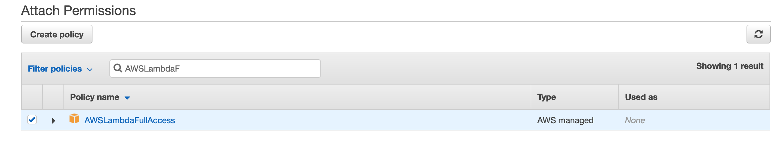

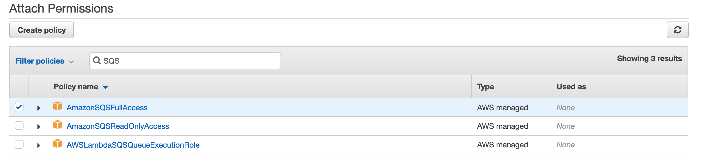

#### Name

Creates streaming inference pipelines

#### Synopsis
```sh
sagify cloud create-streaming-inference --name WORKER_NAME --endpoint-name ENDPOINT_NAME --input-topic-name FEATURES_INPUT_TOPIC_NAME --output-topic-name PREDICTIONS_OUTPUT_TOPIC_NAME --type STREAMING_INFERENCE_TYPE
```

#### Description

This command creates a worker as a Lambda function that listens to features in the `FEATURES_INPUT_TOPIC_NAME`, calls the the endpoint `ENDPOINT_NAME` and, finally, forwards predictions to `PREDICTIONS_OUTPUT_TOPIC_NAME`.

#### Required Flags

`--name WORKER_NAME`: The name of the Lambda function

`--endpoint-name ENDPOINT_NAME`: The name of the endpoint of the deployed model

`--input-topic-name FEATURES_INPUT_TOPIC_NAME`: Topic name where features will be landed

`--output-topic-name PREDICTIONS_OUTPUT_TOPIC_NAME`: Topic name where model predictions will be forwarded

`--type STREAMING_INFERENCE_TYPE`: The type of streaming inference. At the moment, only `SQS` is supported!

#### Example
```sh
sagify cloud create-streaming-inference --name recommender-worker --endpoint-name my-recommender-endpoint-1 --input-topic-name features --output-topic-name model-predictions --type SQS
```


### Cloud Delete Streaming Inference

NOTE: THIS IS AN EXPERIMENTAL FEATURE

Make sure that the following 2 policies are attached to the role you created in section "Configure AWS Account":


#### Name

Deletes streaming inference pipelines

#### Synopsis
```sh
sagify cloud delete-streaming-inference --name WORKER_NAME --input-topic-name FEATURES_INPUT_TOPIC_NAME --output-topic-name PREDICTIONS_OUTPUT_TOPIC_NAME --type STREAMING_INFERENCE_TYPE
```

#### Description

This command deletes the worker (i.e. Lambda function), input topic `FEATURES_INPUT_TOPIC_NAME` and output topic `PREDICTIONS_OUTPUT_TOPIC_NAME`.

#### Required Flags

`--name WORKER_NAME`: The name of the Lambda function

`--input-topic-name FEATURES_INPUT_TOPIC_NAME`: Topic name where features will be landed

`--output-topic-name PREDICTIONS_OUTPUT_TOPIC_NAME`: Topic name where model predictions will be forwarded

`--type STREAMING_INFERENCE_TYPE`: The type of streaming inference. At the moment, only `SQS` is supported!

#### Example
```sh
sagify cloud delete-streaming-inference --name recommender-worker --input-topic-name features --output-topic-name model-predictions --type SQS
```


### Cloud Lightning Deploy

#### Name

Command for lightning deployment of pre-trained ML model(s) on AWS SageMaker without code

#### Synopsis
```sh
sagify cloud lightning-deploy --framework FRAMEWORK --num-instances NUMBER_OF_EC2_INSTANCES --ec2-type EC2_TYPE --aws-profile AWS_PROFILE --aws-region AWS_REGION --extra-config-file EXTRA_CONFIG_FILE [--model-server-workers MODEL_SERVER_WORKERS] [--s3-model-location S3_LOCATION_TO_MODEL_TAR_GZ] [--aws-tags TAGS] [--iam-role-arn IAM_ROLE] [--external-id EXTERNAL_ID] [--endpoint-name ENDPOINT_NAME]
```

#### Description

This command deploys a pre-trained ML model without code. 

#### Required Flags

`--framework FRAMEWORK`: Name of the ML framework. Valid values: `sklearn`, `huggingface`, `xgboost`

`--num-instances NUMBER_OF_EC2_INSTANCES` or `n NUMBER_OF_EC2_INSTANCES`: Number of ec2 instances

`--ec2-type EC2_TYPE` or `e EC2_TYPE`: ec2 type. Refer to https://aws.amazon.com/sagemaker/pricing/instance-types/

`--aws-profile AWS_PROFILE`: The AWS profile to use for the lightning deploy command

`--aws-region AWS_REGION`: The AWS region to use for the lightning deploy command

`--extra-config-file EXTRA_CONFIG_FILE`: Json file with ML framework specific arguments

For SKLearn, you have to specify the `framework_version` in the EXTRA_CONFIG_FILE and specify the S3 location to model tar.gz (i.e. tar gzip your sklearn pickled file

#### Optional Flags

`--s3-model-location S3_LOCATION_TO_MODEL_TAR_GZ` or `-m S3_LOCATION_TO_MODEL_TAR_GZ`: Optional S3 location to model tar.gz

`--aws-tags TAGS` or `-a TAGS`: Tags for labeling a training job of the form `tag1=value1;tag2=value2`. For more, see https://docs.aws.amazon.com/sagemaker/latest/dg/API_Tag.html.

`--iam-role-arn IAM_ROLE` or `-r IAM_ROLE`: AWS IAM role to use for deploying with *SageMaker*

`--external-id EXTERNAL_ID` or `-x EXTERNAL_ID`: Optional external id used when using an IAM role

`--endpoint-name ENDPOINT_NAME`: Optional name for the SageMaker endpoint

#### Example for SKLearn

Compress your pre-trained sklearn model to a GZIP tar archive with command `!tar czvf model.tar.gz $your_sklearn_model_name`.
```sh
sagify cloud lightning-deploy --framework sklearn -n 1 -e ml.c4.2xlarge --extra-config-file sklearn_config.json --aws-region us-east-1 --aws-profile sagemaker-dev -m s3://my-bucket/output/model.tar.gz
```

The `sklearn_config.json` must contain the following flag `framework_version`. Supported sklearn version(s): 0.20.0, 0.23-1.
 
Example of `sklearn_config.json`:
```json
{
    "framework_version": "0.23-1"
}
```

#### Example for HuggingFace by specifying the `S3_LOCATION_TO_MODEL_TAR_GZ`

Compress your pre-trained HuggingFace model to a GZIP tar archive with command `!tar czvf model.tar.gz $your_hg_model_name`.
```sh
sagify cloud lightning-deploy --framework huggingface -n 1 -e ml.c4.2xlarge --extra-config-file huggingface_config.json --aws-region us-east-1 --aws-profile sagemaker-dev -m s3://my-bucket/output/model.tar.gz
```

The `huggingface_config.json` must contain the following flags  `pytorch_version` or `tensorflow_version` (not both), and `transformers_version`. For more info: https://sagemaker.readthedocs.io/en/stable/frameworks/huggingface/sagemaker.huggingface.html#hugging-face-model.
 
Example of `huggingface_config.json`:
```json
{
    "transformers_version": "4.6.1",
    "pytorch_version": "1.7.1"
}
```

#### Example for HuggingFace without specifying the `S3_LOCATION_TO_MODEL_TAR_GZ`
```sh
sagify cloud lightning-deploy --framework huggingface -n 1 -e ml.c4.2xlarge --extra-config-file huggingface_config.json --aws-region us-east-1 --aws-profile sagemaker-dev
```


The `huggingface_config.json` must contain the following flags  `pytorch_version` or `tensorflow_version` (not both), `transformers_version` and `hub`. For more info: https://sagemaker.readthedocs.io/en/stable/frameworks/huggingface/sagemaker.huggingface.html#hugging-face-model.
 
Example of `huggingface_config.json`:
```json
{
    "transformers_version": "4.6.1",
    "pytorch_version": "1.7.1",
    "hub": {
    "HF_MODEL_ID": "gpt2",
    "HF_TASK": "text-generation"
    }
}
```
        
#### Example for XGBoost

Compress your pre-trained XGBoost model to a GZIP tar archive with command `!tar czvf model.tar.gz $your_xgboost_model_name`.
```sh
sagify cloud lightning-deploy --framework xgboost -n 1 -e ml.c4.2xlarge --extra-config-file xgboost_config.json --aws-region us-east-1 --aws-profile sagemaker-dev -m s3://my-bucket/output/model.tar.gz
```

The `xgboost_config.json` must contain the following flag `framework_version`. Supported xgboost version(s): 0.90-2, 1.0-1, and later.
 
Example of `xgboost_config.json`:
```json
{
    "framework_version": "0.23-1"
}
```


### Cloud Foundation Model Deploy

#### Name

Command for deployment of Foundation models on SageMaker without code

#### Synopsis
```sh
sagify cloud foundation-model-deploy --model-id MODEL_ID --model-version MODEL_VERSION --num-instances NUMBER_OF_EC2_INSTANCES --ec2-type EC2_TYPE --aws-profile AWS_PROFILE --aws-region AWS_REGION [--aws-tags TAGS] [--iam-role-arn IAM_ROLE] [--external-id EXTERNAL_ID] [--endpoint-name ENDPOINT_NAME]
```

#### Description

This command deploys a Foundation model without code. 

#### Required Flags

`--model-id MODEL_ID`: Model id of the Foundation model. For more, see the list of Foundation models https://sagemaker.readthedocs.io/en/stable/doc_utils/pretrainedmodels.html.

`--model-version MODEL_VERSION`: Model verion of the Foundation model (default: 1.* which fetches the latest of this major version)

`--num-instances NUMBER_OF_EC2_INSTANCES` or `n NUMBER_OF_EC2_INSTANCES`: Number of ec2 instances

`--ec2-type EC2_TYPE` or `e EC2_TYPE`: ec2 type. Refer to https://aws.amazon.com/sagemaker/pricing/instance-types/

`--aws-profile AWS_PROFILE`: The AWS profile to use for the lightning deploy command

`--aws-region AWS_REGION`: The AWS region to use for the lightning deploy command

#### Optional Flags

`--aws-tags TAGS` or `-a TAGS`: Tags for labeling a training job of the form `tag1=value1;tag2=value2`. For more, see https://docs.aws.amazon.com/sagemaker/latest/dg/API_Tag.html.

`--iam-role-arn IAM_ROLE` or `-r IAM_ROLE`: AWS IAM role to use for deploying with *SageMaker*

`--external-id EXTERNAL_ID` or `-x EXTERNAL_ID`: Optional external id used when using an IAM role

`--endpoint-name ENDPOINT_NAME`: Optional name for the SageMaker endpoint


### LLM Start Infrastructure

#### Name

Command to start LLM infrastructure

#### Synopsis
```sh
sagify llm start --all --chat-completions --image-creations --embeddings [--config EC2_CONFIG_FILE] --aws-profile AWS_PROFILE --aws-region AWS_REGION [--aws-tags TAGS] [--iam-role-arn IAM_ROLE] [--external-id EXTERNAL_ID]
```

#### Description

It spins up the endpoints for chat completions, image creation and embeddings.

#### Required Flags

`--all`: Start infrastructure for all services. If this flag is used the flags `--chat-completions`, `--image-creations`, `--embeddings` are ignored.

`--chat-completions`: Start infrastructure for chat completions.

`--image-creations`: Start infrastructure for image creations.

`--embeddings`: Start infrastructure for embeddings.

`--config EC2_CONFIG_FILE`: Path to config file to override foundation models, ec2 instance types and/or number of instances.

`--aws-profile AWS_PROFILE`: The AWS profile to use for the lightning deploy command

`--aws-region AWS_REGION`: The AWS region to use for the lightning deploy command

#### Optional Flags

`--aws-tags TAGS` or `-a TAGS`: Tags for labeling a training job of the form `tag1=value1;tag2=value2`. For more, see https://docs.aws.amazon.com/sagemaker/latest/dg/API_Tag.html.

`--iam-role-arn IAM_ROLE` or `-r IAM_ROLE`: AWS IAM role to use for deploying with *SageMaker*

`--external-id EXTERNAL_ID` or `-x EXTERNAL_ID`: Optional external id used when using an IAM role


### LLM Stop Infrastructure

#### Name

Command to stop LLM infrastructure

#### Synopsis
```sh
sagify llm stop --all --chat-completions --image-creations --embeddings --aws-profile AWS_PROFILE --aws-region AWS_REGION [--aws-tags TAGS] [--iam-role-arn IAM_ROLE] [--external-id EXTERNAL_ID]
```

#### Description

It stop all or some of the services that are running.

#### Required Flags

`--all`: Start infrastructure for all services. If this flag is used the flags `--chat-completions`, `--image-creations`, `--embeddings` are ignored.

`--chat-completions`: Start infrastructure for chat completions.

`--image-creations`: Start infrastructure for image creations.

`--embeddings`: Start infrastructure for embeddings.

`--aws-profile AWS_PROFILE`: The AWS profile to use for the lightning deploy command

`--aws-region AWS_REGION`: The AWS region to use for the lightning deploy command

#### Optional Flags

`--aws-tags TAGS` or `-a TAGS`: Tags for labeling a training job of the form `tag1=value1;tag2=value2`. For more, see https://docs.aws.amazon.com/sagemaker/latest/dg/API_Tag.html.

`--iam-role-arn IAM_ROLE` or `-r IAM_ROLE`: AWS IAM role to use for deploying with *SageMaker*

`--external-id EXTERNAL_ID` or `-x EXTERNAL_ID`: Optional external id used when using an IAM role
